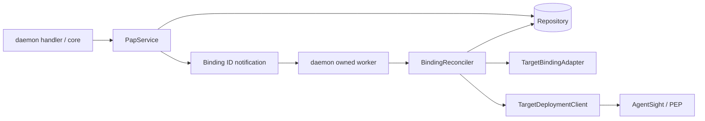

# Binding Reconciler 设计与实现方案

文档类型：`[TARGET V2]` 详细设计与实施计划。实现进度和验证结果由对应 PR、CI 与
验收报告记录，本文定义架构、行为约束和验收要求。

[调度、存储与恢复设计](BINDING_RECONCILER_RUNTIME_DESIGN_zh.md)
是后续 Runtime 集成的当前目标。其 CR-010～CR-015 替代本文中“整体聚合写入作为 SQL
接口”“prepared 跨重启持久化”“队列去重/容量/补扫仅留 TODO”的旧提案：部署独立局部更新，
每次 reconcile 重新读取 Binding 并从头执行，plan/prepared/返回结果仅在本次调用内使用，
不跨调用缓存或落库；旧的 prepared 复用及跨调用结果补写机制均被替代。dirty 仅负责再次排队。
调度实现归 `asc-policy-runtime`，daemon 负责装配。具体流程见新设计第 7 节。
本文的已有源码说明与历史测试证据保留，不代表新设计已实现；spec-only revision、删除及
目标清理责任等未被替代的语义继续有效。

Runtime 接线 PR 的门禁为单元、组件与调度竞争测试；完整进程链路 E2E 单独开 PR；
系统性 error injection、进程崩溃及恢复测试待 persistent Repository 就绪后交付。
本文原全链路验收清单是跨 PR 索引，不得据此把上述后续测试重新作为 Runtime 集成 PR 的前置条件。

## 1. 文档边界与关联文档

本文将 [设计讨论记录](BINDING_RECONCILER_DECISIONS_zh.md) 收敛为可实施方案，覆盖
PAP API contract 修正、Binding 状态、持久化、Adapter/Client、Reconciler、daemon
装配及分层验收。已确认的产品语义与本次补充的实现提案分别说明；类型名、表名和
配置默认值是实现提案，应在对应工作包的 Definition Review 中用可执行 fixture 固定。
本文不把 Markdown 用例编号计作已实现、已通过或生产就绪。

[Rust 迁移架构](AGENT_SEC_RUST_MIGRATION_zh.md) 仍是产品与 crate 边界的权威入口。
本文不是新增的 V1 行为契约。涉及公开协议、后台服务或进程生命周期的实施，必须在
同一变更中更新相应语言无关契约及 executable fixtures。

关联文档分别承担设计决定、验收标准和执行证据：

- [设计讨论记录](BINDING_RECONCILER_DECISIONS_zh.md)：spec-only revision、删除与目标清理责任。
- [调度、存储与恢复设计](BINDING_RECONCILER_RUNTIME_DESIGN_zh.md)：Runtime 集成和分阶段 PR 边界。
- [核心验收标准](../../v2/fixtures/reconciliation/ACCEPTANCE.md)：完整 fixtures 与判定规则。
- [执行报告](../../v2/fixtures/reconciliation/RESULTS.md)：具体版本、运行命令和验证结果。

源码版本及直接依赖记录在工作包的验收报告中。

## 2. 已确认目标与首阶段范围

### 2.1 不变量

1. Policy、Scope、Binding 各自按稳定 ID 只保存一个 current 完整记录。
2. `bindingRevision` 严格标识 spec：创建为 1，仅 spec 改变时 `+1`。
   Delete、同 spec 失败重试和 worker 状态推进不增版。删除成功后移除记录，
   重新部署通过 CREATE 生成新 Binding ID、revision 1；旧 ID 不复用。
3. Binding spec 的内容是嵌入的 Policy/Scope 完整快照，包括引用的 ID 和 revision；
   比较内容时排除 Binding 自身的 revision、status、部署记录、错误和重试元数据。
4. Policy/Scope 更新不会自动更新已有 Binding；已有 Binding 可继续使用其嵌入快照，
   新 Binding 只能引用仍为 current 的来源版本。Policy/Scope 的既有增版规则不变。
5. PAP 原子保存用户意图并快速返回；目标翻译与 PEP 操作由异步 Reconciler 完成。
6. `APPLYING` 时允许 Delete，将 status 改为 `PENDING_DELETE`，不增加 revision。
   `APPLYING` 的 changed-spec UPDATE 被拒绝；所有删除侧状态拒绝 UPDATE，不可撤销删除。
7. 一个逻辑 Binding 的本地目标操作串行；PAP 准入不等待整个目标调用完成。
8. 旧任务可以保存自己产生的目标事实，但不能覆盖更新后的用户意图和运行状态。
9. 目标可能被创建前，先持久化可定位、可清理的身份；先保存目标结果，再报告完成。
10. Delete 清理该 Binding 的全部未确认不存在的目标，不能只从当前 revision 推导一个 ID。
11. 有界重试预算与部署记录保存在 repository；失败和超时不抹掉清理责任。
    SQL 阶段增加跨重启保留保证；首阶段内存丢失的限制见第 2.2 节。
12. `READY` 和删除完成表示已确认结果，不是远端持续实时保证；`Deleted` 仅为内部完成标记，不持久化为 current record。

### 2.2 本阶段交付与延期项

本阶段交付：API 语义对齐、原子请求准入、内存部署记录、稳定请求准备、Client update
及部分结果、按 Binding 串行执行、内存意图与重试、基本事件交接、
shutdown、必要的错误投影，以及对应 crate/内存 repository/UDS 验收。

首阶段使用 `ProcessLocalPapRepository`，SQL
适配及真实跨重启恢复不是功能实现的前置条件。进程退出会丢失 Binding、部署记录、
请求快照和重试预算；PEP 对象可能仍存在，不能声明可自动恢复或自动清理这些遗留对象。
本文后续的“持久化”“durable”“事务提交”描述目标存储契约：首阶段落实为内存
repository 内的原子保存；文件耐久性、数据库迁移、关闭重开及重启恢复仅在 SQL
阶段验收。此阶段划分适用于全文，不能将内存保存当作磁盘持久化证据。

延期项：持续漂移检测、多 PEP 聚合、分布式 worker、跨服务操作顺序协议、原子远端
替换、自动回滚；job queue 去重、可配置并发池、throttle、容量控制和公平性只留 TODO。
到期重试属于首版核心功能；定期 repository 补扫首阶段只留 TODO，不作为验收
前置条件。基本事件交接归交互块，不引入通用 periodic scheduler。

首阶段可用单个串行 worker；端口保持按 Binding 互斥语义，未来不同 Binding 可以并发。
不要求先实现通用队列框架，才能交付正确的单次 `reconcile(binding_id)`。

## 3. Binding revision 与完整状态表

### 3.1 spec 与操作的关系

```text
创建 spec A       revision=1  PENDING_APPLY
Apply 成功       revision=1  READY
更新为 spec B    revision=2  PENDING_APPLY
请求 Delete      revision=2  PENDING_DELETE
Delete 失败      revision=2  DELETE_FAILED
再次请求 Delete  revision=2  PENDING_DELETE
Delete 成功      移除 Binding 及全部运行记录
相同 spec B CREATE 新 Binding ID，revision=1 PENDING_APPLY
```

同一 revision 可经历多次 Apply 尝试及 Delete 重试。删除后重新部署使用新 ID；
旧 ID 的 GET/UPDATE/DELETE 为 NotFound，LIST 不再包含它。revision 不是状态变化序号。
从 spec A 改为 B，再显式改回 A，也产生新 revision，不能复用旧版本号。
revision 到上限时，changed-spec UPDATE 失败；新 ID 的 CREATE 从 1 开始；Delete、幂等
请求及同一部署的失败重试仍可受理。

### 3.2 PAP 请求转移

下表以“准入事务检查时”的状态为准。`不变`表示返回已有当前值，不重置重试预算、
错误或部署记录。拒绝为既有 `OperationInProgress`；字段非法、引用缺失另按 API 分类。

| 当前状态 | UPDATE 相同 spec | UPDATE 不同 spec | DELETE |
|---|---|---|---|
| 无此 Binding | `NotFound` | `NotFound` | `NotFound` |
| `PENDING_APPLY` | 不变 | `PENDING_APPLY`，revision +1 | `PENDING_DELETE`，revision 不变 |
| `APPLYING` | 不变 | 拒绝 | `PENDING_DELETE`，revision 不变 |
| `READY` | 不变 | `PENDING_APPLY`，revision +1 | `PENDING_DELETE`，revision 不变 |
| `APPLY_FAILED` | `PENDING_APPLY`，revision 不变 | `PENDING_APPLY`，revision +1 | `PENDING_DELETE`，revision 不变 |
| `PENDING_DELETE` | 拒绝 | 拒绝 | 不变 |
| `DELETING` | 拒绝 | 拒绝 | 不变 |
| `DELETE_FAILED` | 拒绝 | 拒绝 | `PENDING_DELETE`，revision 不变 |

CREATE 生成新的 ID、revision 1 和 `PENDING_APPLY`。删除意图不可撤销；所有目标
确认 Absent 后，条件删除 Binding、runtime、deployments 及写回执。
旧 ID 不允许 UPDATE 重建。`APPLY_FAILED` 同 spec UPDATE 沿用 revision 并重置重试预算，
每次执行均重新读取并准备；改变 spec 才递增一次。两者都保留旧目标清理信息。

新的 Apply/Delete 意图重置其重试控制并清除旧的当前操作错误；幂等 no-op 不重置。
相同 spec 从 `READY` UPDATE 是 no-op，不是强制重新下发接口；本阶段不增加 force/retry
method。失败后的显式重试通过已有 UPDATE/DELETE 完成。

### 3.2.1 参考 Kubernetes 的取舍（设计建议）

Kubernetes controller 从期望状态出发，驱动实际状态并回写观察结果；本服务采用
同样的方向，事件只唤醒，执行依据是 repository 当前意图和目标记录。
参见 [Controllers](https://kubernetes.io/docs/concepts/architecture/controller/)。

Kubernetes finalizer 在清理完成前保留待删除对象；本服务保留 `PENDING_DELETE`
及部署记录直到确认清理完成，借鉴这个责任边界即可，无需引入通用 finalizer 框架。
本服务的删除意图同样不可撤销；清理成功移除记录，重新部署创建新的 Binding。
参见 [Finalizers](https://kubernetes.io/docs/concepts/overview/working-with-objects/finalizers/)。

Kubernetes 使用 resourceVersion 检测更新冲突；本服务不把 bindingRevision 当作
每次写入都变化的 resourceVersion，而使用 repository 内的 revision/status 原子
条件更新及 Runtime 调度串行。首阶段保持已确认的 ING 准入规则，不因参考 Kubernetes
而放开执行中的 changed-spec UPDATE，也不增加 informer 或队列优化前置条件。
参见 [API 更新语义](https://kubernetes.io/docs/reference/using-api/api-concepts/#updates-to-existing-resources)。

### 3.3 Worker 转移

| 当前状态 | 触发 | 下一状态 | revision |
|---|---|---|---|
| `PENDING_APPLY` | 到期且成功认领 | `APPLYING` | 不变 |
| `APPLYING` | 目标结果确认且持久化成功 | `READY` | 不变 |
| `APPLYING` | 可重试且预算未耗尽 | `PENDING_APPLY`，保存下次时间 | 不变 |
| `APPLYING` | 永久失败或预算耗尽 | `APPLY_FAILED` | 不变 |
| `PENDING_DELETE` | 到期且成功认领 | `DELETING` | 不变 |
| `DELETING` | 所有关联目标确认不存在且条件删除成功 | 记录不存在（内部完成标记 `Deleted`） | 不变 |
| `DELETING` | 可重试且预算未耗尽 | `PENDING_DELETE`，保存下次时间 | 不变 |
| `DELETING` | 永久失败或预算耗尽 | `DELETE_FAILED` | 不变 |

Worker 只能执行此表中的转移；PAP 的 `APPLYING -> PENDING_DELETE` 属于请求准入，
不能通过放宽任意 worker 状态写接口来实现。状态表分别维护 request/worker 两类规则。

## 4. API contract 修正与后续清单

### 4.1 变更记录

CR-001 至 CR-008 及删除生命周期修正已实现并同步测试；旧行为列仅记录历史差异。
CR-009 仍为后续工作，尚未加入公开 DTO。

| ID | 已核实的旧行为或缺口 | 目标及待修改内容 |
|---|---|---|
| CR-001 | 当前 `asc-pap/src/service.rs:487` 的 Delete 调用 `next_revision`；PAP 测试删除 2 变 3 | Delete 保留整个 spec，包括 revision；同 revision 原子保存删除意图 |
| CR-002 | `write_binding` 对所有相同 spec 的重新 Apply 都分配 next revision | 按第 3 节区分重试与重新部署：同 spec 失败重试不增版，删除后重新 CREATE 新 ID |
| CR-003 | `BindingStatus::request_delete` 拒绝 `APPLYING`；repository 也统一拒绝 ING 更新 | 允许 Apply 期间 Delete；保持其它 UPDATE 约束；service 和 repository 同步实现 |
| CR-004 | 当前 `v2/README.md` 和请求状态表把新 Apply/Delete 绑定到新 revision | 同步本方案第 3 节、类型 Rustdoc、PAP crate 文档、API 协议及 change record |
| CR-005 | `PapRepository::update_binding` 要求每个 changed write 必须 next revision；现有状态 CAS 只为 worker 服务 | 区分创建、同版重试/删除与 spec 变更；以完整 expected Binding 做条件更新；保护部署/重试字段，分别验证请求和 worker 转移 |
| CR-006 | `pap-crud-e2e.json` 的 delete-binding 返回 `bindingV3`；PAP 测试固定 Delete +1 | 更新完整期望输出与所有后续引用；增加幂等、失败重试、revision 上限及竞争 fixture，不只改一个断言 |
| CR-007 | protocol 第 6.11 节和 README 概述笼统写 CREATE/UPDATE 返回 PENDING_APPLY、DELETE 返回 PENDING_DELETE | 明确新意图返回 pending，幂等调用返回已有状态；READY、APPLYING、DELETING 均可能作为幂等成功返回；删除完成后为 NotFound |
| CR-008 | 原有运行中操作 error case 覆盖范围包含 Apply 期间 Delete | 该场景改为成功；保留真正受限 UPDATE 的 `conflict / binding reconciliation operation is in progress`；不能整体删除该错误 |
| CR-009 | 当前公开 BindingView 只有 spec/status，异步失败无错误/重试说明 | 按第 9 节新增有界运行结果投影，并同步 GET/LIST/mutation schema、序列化兼容与 response bounds；不能直接暴露内部记录 |

CR-001 至 CR-008 是已有语义修正；CR-009 是 Reconciler 引入后的新增可观测性契约，
可以作为单独工作包，但在完整异步流程验收前必须完成。其它既有 envelope/response
大小问题只作为直接依赖约束，不因本清单自动扩展为全量协议重构。

### 4.2 公开方法及返回语义

保留现有五个 allowlisted Binding 方法及请求字段；请求不接受客户端指定的
`bindingRevision`、status、worker ownership、部署记录或重试预算。

| 方法 | params | 成功结果 |
|---|---|---|
| `policy.bindings.create` | `{policyId, policyRevision, scopeId, scopeRevision}` | 新 BindingView，revision 1 |
| `policy.bindings.update` | `{bindingId, policyId, policyRevision, scopeId, scopeRevision}` | 按第 3 节准入后的 BindingView |
| `policy.bindings.delete` | `{id}` | 按第 3 节准入后的 BindingView，spec 不变 |
| `policy.bindings.get` | `{id}` | 当前 BindingView，包括最新已提交运行状态 |
| `policy.bindings.list` | `{limit=100, offset=0}` | 有序当前记录页 `{items, total}` |

mutation 返回准入事务取得的快照；worker 可能在响应发送前继续推进，所以随后 GET
可以出现更新状态。成功 response 保持 `{requestId,result}`，失败保持 `{requestId,error}`。
Delete 接受成功不表示目标已删除；删除完成后旧 ID 返回 NotFound，不保留 DELETED 行。

例：`policy.bindings.delete` 作用于 revision 2 的 READY Binding 时，目标响应中的
`result.spec` 与删除前完全相同，`result.status` 为 `{"phase":"PENDING_DELETE"}`。完整 CRUD fixture
保留原 Policy/Scope、IR、digest，仅调整 status；`bindingPendingDelete` 固定同版响应。

认证继续由 kernel peer credentials 构造 Principal，经 daemon-core 准入；handler
只解码、调用、投影，不自行修改 revision，也不等待 Client。duplicate-key/unknown-param
检查、fresh requestId 和当前 authorization 规则必须继续通过原有 fixture。

现有类型/参数错误仍为 `invalid_request`，领域验证为 `invalid_argument`，资源或来源版本
缺失为 `not_found`，真实并发冲突及受限 UPDATE 为 `conflict`。只有需要增版的操作可因
revision 上限返回 `resource_exhausted`；新 ID CREATE 从 1 开始，Delete 不得
继续触发 RevisionExhausted。提交后的队列容量拒绝确认写入 Failed 后，返回完整
BindingView，通过 status.phase/status.error 表达失败。详见
[队列拒绝契约](BINDING_QUEUE_ADMISSION_ACCEPTANCE_zh.md)。

### 4.3 必须同步的文件与兼容记录

| 范围 | 文件或入口 | 修正责任 |
|---|---|---|
| 领域定义 | `v2/crates/policy/asc-policy-types/src/binding.rs` 及 tests | binding revision 注释、request/worker 转移、公开投影 |
| PAP | `v2/crates/policy/asc-pap/src/{service,repository,lib}.rs`、`tests/pap_service.rs` | 增版判断、请求 CAS、幂等、并发测试 |
| 首阶段内存 adapter | `v2/crates/policy/asc-pap-repository-memory/src/lib.rs` | 实现新 repository contract，明确仅进程存活期间保存 |
| daemon | `asc-daemon-protocol/src/pap.rs`、`asc-daemon-core/src/pap.rs`、`asc-daemon-handler/src/pap.rs` | 方法注释、直接领域类型、错误及 runtime 投影 |
| wire fixtures | `asc-daemon-protocol/tests/fixtures/pap-crud-e2e.json`、`pap-methods.json`、`pap-invalid-requests.json`、`tests/pap_contract.rs` | 完整结构、跨步骤引用、状态/error 场景 |
| UDS | `v2/apps/asc-daemon/tests/pap_protocol.rs` | 完整 serialized scenario 与并发准入消费者测试 |
| 文档 | `docs/design/DAEMON_PROTOCOL_V1_zh.md` 第 6.11 节、`PAP_DAEMON_API_ACCEPTANCE_zh.md`、`v2/README.md` | CR-001 至 CR-009、external compatibility、重新验收记录 |
| 后台服务与部署 | `DAEMON_JOB_CONTRACT_zh.md`、`DAEMON_PROCESS_DEPLOYMENT_CONTRACT_zh.md` | 具体服务触发、健康、恢复、shutdown 与对应 DJOB/DPROC fixture |

PAP 方法是新增 V2 surface，不把新语义写成 `[CURRENT]` V1 事实。此次是可观察语义
修正，不能因为字段形状相同就宣称完全兼容。先记录 CR-001 至 CR-008 的 old/new
行为并更新 conformance 版本；确认尚无受支持外部消费者的开发面可协同升级。
若已作为 supported release 发布，实施包必须提供批准的版本化过渡和 consumer 迁移，
不能让旧客户端继续把“revision 不变”解释成“没有新状态”。本次未核实发布状态。
CR-009 的新字段还必须核实严格解码消费者，不能默认 additive field 自动兼容。

## 5. 组件职责与调用边界



| 组件 | 职责与限制 |
|---|---|
| PapService | 权威 CRUD 语义、来源解析、spec 相等判断与增版、原子准入；不调用 Adapter/PEP |
| Reconciler（`asc-pcp`） | 读取当前意图、认领、调用 Adapter、保存 Client 提供的目标身份与请求、调用 Client、结果记账、CAS 完成与重试 |
| Repository ports | 原子请求更新、worker 状态 CAS、目标记录、持久化扫描；不发 HTTP |
| TargetBindingAdapter | 完整 PreparedBinding 到 TargetBindingPlan；不查询 PAP，不执行副作用 |
| TargetDeploymentClient | 按 PEP 规则准备目标身份与请求、执行 create/update/delete 并解释部分结果；不读写 repository，不回调 repository |
| daemon composition / worker | 注入具体实现，拥有通知、Running entry、定时唤醒、恢复、取消和 join |
| memory adapter（首阶段）/ SQLite adapter（后续） | 相同逻辑原子接口；首阶段内存保存，后续增加 durable state 与跨重启恢复 |

Reconciler 通过窄 repository/adapter/client ports 工作，不依赖 PapService、具体 HTTP、
SQLite 或 daemon binary。复用现有领域类型，不为 CRUD 再建一套同构 domain model。
跨表结果提交需要一个显式事务接口，不能让两个独立 Repository 调用假装原子。

### 5.1 已确认：逻辑 Binding 与 PEP 身份的边界

Reconciler 使用 SecCore Binding ID/revision 关联当前意图，使用 Client 返回的不透明
目标身份关联部署记录；不自行生成或推导 PEP bindingId，不解析 UUID，也不复制
AgentSight 的 UUIDv5 算法。目标 ID 的计算或直接映射是具体 PEP Client 的职责。

AgentSight Client 根据 SecCore Binding ID + revision 派生 UUIDv5；如果另一个 PEP
能够直接使用 SecCore Binding ID，其 Client 可以原样返回，无需强制 hash 或 UUID
转换。因此“所有 PEP 的不同 revision 必须产生不同目标 ID”不是通用契约；通用
Reconciler 只比较和保存 Client 提供的目标身份及来源 revision，目标原地更新或
替换的语义由该 Client 保证。这里说明接口边界，不新增首阶段 PEP 支持范围。

Adapter 负责把完整 Binding 翻译成目标策略与范围表达；Client 负责 PEP 所需身份、
请求准备、传输、更新方式与响应解释；Reconciler 负责通用执行顺序、记录、状态 CAS 和重试；
Runtime/WorkQueue 负责同 Binding 串行。这些职责不因某个 PEP 恰好使用 HTTP、DSL 或 PID 而混合。

## 6. 数据模型与原子接口

读取采用 Binding 聚合视图，写入采用不含 spec 的字段补丁。首版由内存 Repository
在短临界区内实现原子性；SQLite 表结构及耐久事务由后续存储工作包定义。
不要求为 spec 和 deployment 分表，但两者必须有各自的局部更新方式。

### 6.1 存储模型

| 记录 | 内容 | 所有权 |
|---|---|---|
| Binding | 当前 spec 与 status | PAP 修改 spec/意图；Reconciler 条件推进 status |
| deployments | Client 提供的 target 引用、来源 revision、presence、last_confirmed | Reconciler 管理；PAP 修改 spec 时保留 |
| runtime | attempts_started、next_attempt_at、retry_policy、last_error | 新意图重置；幂等通知和自动重试不重置预算 |
| 本次临时数据 | Adapter plan、Client prepared、调用结果、待写回凭据 | 仅存活于单次 reconcile；不进入 Repository schema |

Reconciler 不解析 Client 的 DSL、HTTP body 或进程身份。只有 Client 提供的 target 引用和
cleanup 随 deployment 保存，用于在当前 spec/PID 不可用时清理旧目标。
AgentSight cleanup 仅包含版本、Binding ID 和 revision，不保存请求摘要或进程身份。

presence 为 UNKNOWN、PRESENT、ABSENT。PRESENT 表示最近确认的事实，目标修改前先登记
UNKNOWN 并保留 last_confirmed；确认 Absent 后移除部署记录。route 必须仍解析到原目标，
无法定位时保留清理责任，不能把配置缺失解释成目标不存在。

每次重试重新翻译和准备；spec 更新保留旧 deployment，不保留旧 plan、prepared 或结果。
删除后重新 CREATE 使用新 Binding ID、revision 1；不复用已删除 Binding 的目标身份。

### 6.2 请求准入事务

现有 PAP 基础写接口显式区分创建与条件更新：

```rust
update_binding(expected: Option<&BindingView>, next: &BindingView)
    -> Result<BindingView, PapError>
```

`None` 为 insert-if-absent；`Some` 比较完整 Binding 后更新，记录缺失返回 NotFound，
绝不退化为插入。CREATE 的 ID 由服务端生成，外部 UPDATE 不能指定一个已删除 ID 复活。

PAP 负责选定内容和候选 revision；repository 在事务内读取 current 并验证：

1. expected 与当前值一致；不一致返回 Conflict，由 PAP 重读、重新判断，沿用有界尝试。
2. 请求符合第 3 节；Delete 直接保留库内 spec；同一部署的相同内容重试保持 revision，
   changed spec 要求 next revision；删除侧禁止 Apply，CREATE 要求新 ID 不存在且 revision 1。
3. no-op 返回库内当前值，不重写 retry control；新意图按表更新 spec/status、重置当前
   操作的 retry control 和 error，保留所有部署记录。
4. status 与 next_attempt_at 同时提交，成为 durable reconcile intent。采用 current 行
   即可表达待执行意图，本提案不另建通用 outbox 或历史操作队列。
5. 提交成功后才通知 worker。通知失败不回滚已提交意图，也不让请求重复创建资源；
   由持久化补扫恢复，基础通知处理见第 8 节。

幂等 no-op 返回本次一致读取的已有值，不修改运行字段；实际变更必须通过
完整 expected Binding 的条件更新，以关闭 service 预读与 worker 变更之间的竞争。更新只触及明确拥有的字段，不能用旧 BindingView 全行覆盖
worker 刚写入的目标记录、错误或重试次数。

### 6.3 Worker 内部操作与数据库接口

当前 `asc-policy-repository::BindingStateRepository` 只有两个接口：

| 存储接口 | 原子语义 |
|---|---|
| `get_binding_state(id)` | 一致读取完整 `BindingStateSnapshot { binding, runtime, deployments }`，缺失与存储故障分开返回 |
| `compare_exchange_binding_state(expected, write)` | 局部条件写；`write` 包含 write ID 及 `Option<ReconciliationPatch>`，补丁只有 status/runtime/deployments；None 删除整个聚合；返回 Applied / AlreadyApplied / Conflict |

共享记录及接口位于核心下层，memory adapter 与 Reconciler 都依赖它；memory 不再
依赖 `asc-pcp`。PAP 和 aggregate CAS 使用同一份权威 Binding map；Reconciler 构造
写入不包含 spec，PAP 的请求准入按第 6.2 节实现，存储没有 reconcile 专属业务方法。

`asc-pcp` 内部负责三类决策，不再要求 repository 实现它们：

| 内部操作 | 读取、判断与写入 |
|---|---|
| `claim` | 检查 pending、到期时间和预算；计算 running、attempts +1、固定 retry policy，条件写回运行状态 |
| `register` | 校验本次 prepared/目标身份，仅写 deployments 登记 UNKNOWN，成功后才调用 Client |
| `finish` | 验证并合并观察；原 revision/status 匹配才计算生命周期；删除成功构造 None，其它结果构造字段补丁；过期结果只更新 deployments |

条件写比较 revision/status 及补丁实际修改的 runtime/deployments；删除比较全部协调字段。完成 CAS 冲突后，
核心重读并重新合并；新意图保留，旧任务的有效观察仍可记账并返回 Superseded。
登记和完成的 CAS 竞争最多在一次调用内重试 16 次，耗尽返回存储不可用，由调用方
调度后续尝试；本次调用内只重试写回，调用退出后丢弃结果，下次从头执行。

核心在调用完成 CAS 前缓存精确 write ID、expected 和 write。存储保存最近一次 CAS
写回执，PAP 更新不清除它；提交后 unwind 的相同写入返回 AlreadyApplied，避免再次
处理已经删除的 Absent 行。回执只保证最近写入的重放。调用方由同一个 WorkQueue 调度，前次调用及异常收尾
实际退出后才能再次执行同一 Binding；跨调用不复用结果或写入对象。
整个聚合删除时同时移除回执；缺失 ID 的删除重放返回 AlreadyApplied，替换返回 Conflict。
此幂等性依赖 ID 永不复用，不引入无限保留的 tombstone。删除也比较全部协调字段，不能
因旧任务 revision/status 匹配就抹掉新 runtime 或 deployment。判定清理完成仍在核心。

数据库负责一致读、原子条件写、身份校验和写回执；READY/DELETED 判定、观察归属、
退避计算及本次调用的 slot 不属于存储职责。SQLite 后续实现同一短事务契约，网络
调用始终在事务之外。补扫和 orphan 恢复仍属于后续调度/持久化工作包。

### 6.4 调度串行与同 revision 的竞争

Runtime/WorkQueue 的 Running entry 覆盖“重读 -> claim -> prepare/登记目标 -> Client ->
结果事务 -> 收尾”。同一 Repository 使用一个队列；旧调用及异常收尾实际退出前，重复通知
只设置 dirty，不会让另一个 worker 领取同一 Binding。核心不再维护执行锁表。
PAP 准入不受 Running 阻塞，只使用短 repository 事务。

例：worker 认领 `(revision=2, APPLYING)`；PAP Delete 写入 `(2, PENDING_DELETE)`。
旧 worker 即使成功创建目标，也只能保存目标事实，其 READY/重试/失败状态 CAS 必须
失败。随后 Delete worker 从队列领取，重读并清理包含该新目标在内的全部记录。

`APPLYING -> PENDING_DELETE` 后的所有 UPDATE 均拒绝，不存在转回 Apply 的路径。
同 spec ApplyFailed 重试虽然 revision 不变，仍须等旧结果确认后再 claim，避免同一
Binding 的新旧尝试重叠。“Running 覆盖全部结果写回”由 Runtime 竞争测试保证。

本提案不新增公开 operation revision。同 revision/status CAS 的有效性依赖单 daemon、
本地串行执行与完整 task ownership；未来多 worker 进程、租约抢占或异步晚到写入
需要另外定义内部 fencing，不能沿用本方案并宣称已经安全。

## 7. Client 接口与执行流程

### 7.0 共享契约与依赖方向

内部契约变更记录：Adapter 契约替换 foundation 阶段未被外部消费者
采用的 target 草案。旧 `TargetDescriptor`、`TranslatorIdentity`、artifact metadata、
diagnostics/capability 集合及 `TranslationOutcome` 的 `status/result` JSON envelope
已退役；当前 `TargetBindingPlan` 序列化为 `format/content`，不再有
`artifactContractId/mediaType` 字段。`TranslationOutcome` 与 `TranslationRejection`
是进程内 Rust 返回值，不声明 wire/state 格式；plan、prepared 和 deployment report
保留 serde 用于完整契约 fixture，生产流程不把它们写入 Repository。共享层抽取只调整 import 边界，不再次改变这些格式。
该内部变更不要求保留旧无消费者类型；未来跨进程传递 outcome 时须另定版本化契约。

`asc-policy-target-contracts` 独立定义 `TargetBindingAdapter` 和
`TargetDeploymentClient`；它的运行时依赖只有 `asc-policy-types`。
`TargetBindingPlan`、`TargetRef`、`PreparedApply`、`DeploymentReport`、
`Observation`、`Presence`、`Failure` 和 `FailureKind` 位于
`asc-policy-types::target`，保持该 crate 的纯数据契约边界。

Reconciler 和具体 Client 均依赖共享契约，Client 不依赖 `asc-pcp`。
`asc-pcp` 为既有消费者重导出接口和数据；共享存储记录及数据库端口定义在
`asc-policy-repository`；认领、部署记账和重试决策留在核心内部，串行执行由 Runtime/WorkQueue 保证。
Adapter 可通过现有闭包实现接入共享端口。
PEP 专有 DSL、UUID、HTTP 编码及不透明 prepared/cleanup 内容均不下沉。

真实 Adapter/Core/Client/HTTP 组合测试放在 `asc-pcp` 的测试目标，Client 的独立
测试不依赖核心或内存 Repository。共享层支持多个实现，但本次不新增多 PEP
同时下发、跨路由迁移或分布式事务能力。数据序列化和现有目标操作语义均不改变。
Apply 检测到旧目标与本次目标跨 route 时，以 `Rejected / RECONCILE_TARGET_UNAVAILABLE`
结束本次尝试并进入 APPLY_FAILED，不自动重试；保留全部旧部署责任，不调用 create/update。
这与 Delete 缺少某个旧 route Client 时的有界重试分类不同。

### 7.1 请求准备及稳定输入

每次调用重新读取、翻译和准备，无论 dirty 或 revision 是否变化。本次准备结果原样
交给本次 Client；退出后释放。目标记录用于清理和决定 create/update，不作为步骤断点。


Adapter 负责支持范围内的语义转换和 DSL 编码检查，不依赖单独固定版本的
ActPlane compiler。目标 DSL 是否被接受，以实际部署的 AgentSight/ActPlane 为准。
Client 当前下发前检查请求完整性、进程身份和目标 health/capability，没有远端
validate-only 调用；编译拒绝由 Apply 响应报告。因此 update 仍可能在旧目标删除后
才得知新 DSL 被拒绝。若需在删除旧目标前验证 DSL，须定义使用目标实际编译器的
远端校验契约，不能用本地固定版本编译成功代替。
本次移除 Adapter 的 `ACTPLANE_COMPILER_REJECTED_GENERATED_DSL` 本地故障路径；
计划格式及 frozen DSL 输出不变，现有语义拒绝测试继续作为 Adapter 验收依据。
此变更的验收类型为内部 Adapter 契约调整：Adapter、Client、PCP 三个 crate 的
`cargo test -p asc-policy-adapter-agentsight -p asc-agentsight-client -p asc-pcp --locked --offline`
应覆盖完整 Adapter golden、直接消费者及 loopback HTTP mock 组合测试；
具体结果见验收报告，不代表真实部署版本的编译兼容性。回退须一起恢复编译器调用、依赖、lockfile 和
编译断言，无 wire/state 格式迁移；不得恢复仅凭本地编译成功宣称目标兼容的结论。

当前 [AgentSight Client](../../v2/crates/integrations/asc-agentsight-client/README.md)
实现 `asc-policy-target-contracts::TargetDeploymentClient`，只保留下列稳定准备/重放
路径。旧 `apply(plan)` 和 `delete(binding_id, revision)` 入口已移除，避免同一 UUID
下每次重新读取进程 start time；自定义 resolver 必须实现 boot identity：

```text
prepare_apply(plan) -> PreparedApply
create(prepared) -> DeploymentReport
update(previous_targets, prepared) -> DeploymentReport
delete(targets) -> DeploymentReport
```

- `prepare_apply` 只做本地验证、身份解析和序列化，不发改变目标状态的请求。
  输出包含 target 身份、完整稳定 request body、格式版本与 digest；随后由 Reconciler
  登记 target 引用，再调用 Client；prepared 仅保留在本次调用内。credential 由 Client 管理。
- `create(prepared)` 就是创建操作，执行目标请求并返回结果，不是创建前的逻辑。
  此前讨论中的 `apply_prepared` 指同一能力，不保留同义方法。trait delete 委托
  `delete_targets` 批量清理；每批只解析一次目标引用，并在首个修改请求前验证全量
  引用。update 的旧目标清理复用该验证结果。
- `prepare_apply` 不重复 Adapter 翻译，也不写 repository；AgentSight 的 UUIDv5、
  进程身份解析和请求编码都在 Client 内。Reconciler 将本次 prepared
  原样交给匹配的 Client，不理解或重新构造其目标专有内容。
- `update` 封装具体 PEP 的更新机制；AgentSight 当前按先清理旧目标、再创建新目标
  实现。其他 PEP 可支持原地更新，不把先删后建固化成 Reconciler 的通用步骤。
- AgentSight 本次准备固定 PID、start time、boot identity 和请求摘要，发送前再次校验。
  下一次调用重新解析当前进程身份，不保留跨次比对依据，也不保证跨次仍为同一进程。
- `previous_targets` 含实际部署记录，必须按 target 身份去重并排除本次新目标身份。
  即使新目标已以 UNKNOWN 登记，也不能把它放入“先删除的旧目标”集合。
- 旧 revision 记录只需可定位/可清理输入，不要求重新运行旧 Adapter 或保存旧完整 IR。
  Delete 不调用 Adapter，不需要当前 PID 仍存活，也不从当前 revision 猜目标列表。

调用及保存顺序为：

```text
Adapter.translate(完整 Binding)
  → Client.prepare_apply(plan)：生成目标身份与不透明 prepared
  → Reconciler：原子登记 UNKNOWN 目标记录；prepared 留在本次调用内
  → Client.create(prepared) 或 Client.update(previous_targets, prepared)
  → Reconciler：保存结果并按 expected revision/status 推进状态
```

所有 repository 读写均由 PAP/Reconciler 通过 repository port 发起，Client 不持有
repository，也不通过回调更新它。上述请求前保存首阶段为内存原子保存，SQL 阶段
才具有跨重启耐久性。

`DeploymentReport` 包含每个受影响目标的 confirmed Present/Absent 或 Unknown、
整体操作的完成/可重试/拒绝分类，以及有界安全 code。部分失败也必须携带已确认的
子结果，例如 A 已删除但 B 创建失败；不能用单个 Err 丢掉 A 的确认事实。
若 Client/进程未返回，预先保存的 UNKNOWN 和旧目标记录就是恢复依据。

### 7.2 Apply/Update 单次流程

1. Runtime 领取并标记 Running 后重读 current；终态或未到期时跳过。
2. 原子 claim 当前 Apply，保存 running 与消耗的一次预算。
3. Adapter 重新翻译完整 spec 后由 Client 准备本次请求。
   deterministic rejection 直接产生永久失败；准备失败也不得调用目标修改接口。
4. 原子登记新目标 UNKNOWN，保留旧目标；提交失败则不发请求。
5. 目标登记的条件写检查当前意图；若已被覆盖则停止调用。登记后仍可能与新 Delete
   竞争，需保留目标记账和最终状态 CAS。
6. 无关联目标需要更新时调用 create；有关联部署时调用 update，包括 PEP 复用同一
   目标 ID 原地更新的情况。Reconciler 用 Client 提供的身份区分本次目标与其它旧目标，
   不能把本次目标误作待删除对象；预登记的 UNKNOWN 不属于断点缓存。
   部署记录与 prepared 由 Reconciler 提供，PEP 内部步骤由 Client 封装。
7. Client 返回全部可确认结果；Reconciler 提交结果事务。只有新目标明确 Present、
   需要替换的旧目标全部明确 Absent，且 current 仍匹配该 claim，才写 READY。
8. 若被新意图覆盖，返回 Superseded，只保存目标事实；有新通知时调度器立即检查最新意图，
   否则经过有次数上限的延迟重试。

Client 的 update 可以有策略短暂未生效窗口，本阶段不承诺原子替换。失败不自动回滚 A。
若一个旧目标删除失败，Client 不应继续创建 B 并把整体报告为成功；已完成部分仍返回。

### 7.3 Delete 单次流程

1. Runtime 领取并标记 Running 后重读当前 `PENDING_DELETE`，原子 claim 到 `DELETING`。
2. 枚举该 Binding 全部尚未确认不存在的目标；保留其原 target 和来源 revision。
3. 若没有目标，只有在前置登记不变量成立、且旧本地 worker 已完整退出的前提下，
   才能直接条件删除整个聚合。不能对旧格式、记录丢失或配置不可读的状态使用此捷径。
4. Client 按实际目标记录逐个执行幂等删除，返回所有部分确认。首阶段串行处理即可。
5. Reconciler 保存各目标观察；全部明确 Absent 且原意图匹配时，才条件删除整个聚合。
   任一 Unknown/失败保留清理责任，按分类和预算重试或写 DELETE_FAILED。

现有 AgentSight delete 仅将 204 或带 `binding_not_found` code 的 404 当作 absence；
其它 2xx、无明确 code 的 404 不能被泛化为删除成功。新 Client port 保留这个边界。
absence 解析只读取 code，不能依赖 retryable 字段存在或格式正确。一般错误缺省
retryable 为 false，但 429/5xx 仍可重试。Client 配置只允许 IP 字面量 loopback
使用 HTTP，其它地址必须 HTTPS；本地 localhost 配置应改用 127.0.0.1 或 ::1。
prepared boot ID 按 UUID 值比较，合法非规范写法等价，nil/非法 UUID 属无效载荷。

### 7.4 幂等与远端协作限制

稳定目标 ID 是必要条件，还需完整 body 相等的 create 重放和 absent delete 行为。
目标已存在且内容相同才可认作原操作；内容不同必须冲突，不能以 UUID 相同判成功。
重试 update 时区分旧目标与本次新目标，不能先把上次已成功创建的 B 删除再重建。
这些要求由 Client wire fixture 验证，再由真实 AgentSight 联调确认。

AgentSight 当前会保留 Detached 记录，同 UUID/同 body Apply 直接返回 Detaching 或
Detached（`src/agentsight/src/enforcement/coordinator.rs` 的 apply/detach）。因此必须
区分“同次部署重试”和“删除后重新部署”：后者使用新 Binding ID，现有 UUIDv5
算法自然产生新目标 ID。新请求仍需先登记，旧目标记录仍保留到明确清理完成。
不新增独立部署代次字段，也不通过 Delete 增版解决此问题。

本地 HTTP 返回/超时不意味着远端停止。Apply 超时后 Delete 即使收到成功，远端先前
Apply 仍可能晚完成；本阶段没有远端操作查询/fencing/order 协议来排除此情形。
所以删除完成只表示各次删除响应及原子提交确认的 absence，不是对未来不再出现
目标的保证。此限制必须保留在验收与发布说明，不能用本地锁或 SQLite CAS 替代证明。

## 8. 通知、重试、恢复与 daemon 生命周期

本节保留旧核心阶段的范围与提案。后续 Runtime 集成以
[新设计](BINDING_RECONCILER_RUNTIME_DESIGN_zh.md)第 4～9 节为准：实现 dirty 合并、
WaitingRetry、容量及补偿；重启不恢复 prepared。跨重启只保留 Binding 状态/错误和目标责任；次数与 deadline 重置。

### 8.1 意图与 Runtime 调度

Repository 中的 Binding spec、status/error 与 deployments 是持久状态边界；
当前实现仍为内存 Repository。次数与 next_attempt_at 由 WorkQueue 的 AttemptSchedule 持有，
内存通知只携带 Binding ID。PAP 成功提交后尝试唤醒；worker 获取执行权后重读。
重复或乱序通知不能直接调用旧命令，不能增加重试次数，也不能重置退避时间。

Runtime 已实现有界 WorkQueue、dirty 合并、到期 timer 与按稳定 Binding ID 的分页补扫。
队列拒绝后 PAP 条件写入 Failed 和原因并返回完整 BindingView；若 worker 已认领则返回当前状态。
补扫只重新发现 pending/running，不自动恢复 Failed。Running 条目直到调用实际退出
才结束。同一 Repository 使用一个 Runtime。跨进程恢复仍需后续持久化 Repository。

### 8.2 重试参数与计数提案

当前 daemon 采用以下内部默认值，不暴露额外 CLI 配置：

| 参数 | 默认值 | 语义 |
|---|---|---|
| max_attempts | 5 | 包含首次，在 claim 时消耗 |
| base_delay / max_delay | 1 秒 / 30 秒 | 指数退避 |
| request_timeout | 10 秒 | Client 单次 HTTP 请求期限，不证明远端取消 |
| workers / queue capacity | 4 / 65,536 | 容量包含排队、执行、等待和耗尽条目，按实际条目分配内存 |
| scan page / tick interval | 128 / 100ms | 按稳定 ID 分页补扫与检查到期 |
| storage retry | 1 秒 | 存储失败后的调度等待 |
| shutdown drain | 30 秒 | 等待 Runtime join；外层 Tokio 再有 1 秒停机上限 |

首版没有独立的整个 reconcile attempt timeout；一次调用可能包含多个目标请求。
停机超时由进程退出结束等待，不能视为远端请求已取消。

第 n 次失败后，若仍可重试：`delay = min(max_delay, base_delay * 2^(n-1))`，
使用饱和计算。首阶段可不加 jitter；测试使用可控时钟，不以真实 sleep 验证退避。
等待退避时 entry 转为 WaitingRetry，释放 worker 资源。

attempts_started 在 claim 事务中、任何外部副作用前递增。daemon 在 claim 后崩溃，
该次仍计入预算。相同 pending UPDATE、重复 DELETE、重复通知及进程重启均不重置。
用户显式从失败状态重试、切换 Apply/Delete 或修改 spec，才产生新的操作预算。
新 Delete 不继承旧 Apply 的退避时间或错误。

Adapter 语义拒绝、Client 明确拒绝不重试；暂时不可用或结果不明按安全分类重试。
错误是否可重试与目标是否存在分别保存：不可重试也不能删除 UNKNOWN 记录。
持久化失败由服务 health 报告，不能因为无法写结果而伪造 READY/DELETED；后续调用先恢复存储状态，再按当前意图重新执行。

### 8.3 崩溃窗口与恢复处理（跨重启部分为后续 SQL 阶段）

首阶段验证进程内原子更新、请求失败和任务收尾；本表涉及进程退出后恢复已有记录
的场景，依赖 SQL repository，仅作为后续契约。内存重建不能通过这些验收，也不阻碍
首阶段功能交付。进程内基本任务交接、定期补扫由 Runtime 的组件测试验收。

| 崩溃/故障窗口 | 恢复依据与动作 |
|---|---|
| PAP 提交前失败 | 没有新意图；不通知、不调用目标 |
| PAP 提交后、通知前退出 | 扫描 durable pending，恢复该 ID |
| claim 后、准备或请求前退出 | attempts 已消耗；不增加 revision，按预算恢复 |
| 新目标登记后、实际创建前退出 | UNKNOWN 仍需保守处理；重试复用请求，Delete 可以多做一次幂等清理 |
| A 已删除、B 尚未创建或创建失败 | 保留未确认目标；重放 update 正确跳过已确认不存在的 A，不把 B 当旧目标删除 |
| B 创建成功、结果事务前退出 | B 仍 UNKNOWN；同一请求重放/确认，不能重新生成目标身份或改变进程信息 |
| 结果事务中失败 | 事务整体回滚；已有 UNKNOWN/旧记录保留，不能报告完成 |
| 目标观察与终态事务已提交、通知/响应前退出 | 恢复见终态，不无条件重新执行 |
| Apply 执行时 PAP Delete 已提交 | 旧 task 目标结果可记账，旧 lifecycle CAS 失败；下一次执行最新 Delete |
| 永久失败或耗尽后重启 | 保持 FAILED，不自动恢复预算；等待新的用户请求 |

启动恢复在获取 host singleton 后运行，拒绝不兼容 schema，并建立 worker 所有权。
将上一进程遗留的 APPLYING/DELETING 当作未知结果的已开始尝试：保留所有记录和预算；
预算耗尽时记失败，否则恢复对应 pending 并安排退避，不能直接标记成功。
本进程运行中的 task 不能被补扫误作 orphan；只能在其已退出/完整 join 后由队列重新领取后恢复。

重启后的退避沿用持久化时间；识别时钟异常时使用不超过 max_delay 的保守重新等待，
不重置 attempts。此项需 fake-clock 的前跳/后跳 fixture，避免重启无限等待或无限重试。

### 8.4 Readiness、health、取消与 shutdown

Reconciler 是 daemon 注册并拥有的具体 background service：首阶段触发为已提交
Binding 意图和到期重试；启动恢复与补扫属于后续阶段。所有任务可追踪、可取消并可 join。

readiness 前置条件是配置与 repository 可用、调度路径已建立；后续 SQL 阶段增加
schema 校验和恢复查询就绪条件。
不要求所有历史 Binding 已完成远端 Apply 才 Ready；远端不可用导致具体 Binding
重试/失败，不等于 daemon 未启动。恢复存储不可读、worker 无法运行则报告非就绪或
degraded，具体映射在 DJOB/DPROC fixture 固定，不能把 systemd active 当作 readiness。

shutdown 顺序：停止新的 mutation 准入和通知触发，停止新 claim，等待已拥有执行
有界收尾并保存可保存的观察；时间耗尽时保留 UNKNOWN/running 与已消耗预算供恢复。
blocking 调用必须有超时并受 ownership 管理；不能取消外层 future 后丢弃仍在后台
运行的调用，然后把同一 ID 交给新 worker。进程退出后的远端晚完成仍受第 7.4 节限制。

health 使用 running/degraded/stopped 与最近 outcome 分开表达。一次策略被目标拒绝
只改变该操作 outcome，不把长期服务永久设成失败。补扫持续失败、timer/scanner 或调度线程异常退出
反映到服务 health。单 Binding 存储/数据错误输出安全诊断并安排重试，
CAS 耗尽独立返回 Contended；自动重调度必须等待且默认最多 4 次。耗尽后保持 Running，
条件写入 Failed/RECONCILE_RETRY_EXHAUSTED，确认后释放 slot；仅终止未确认时保留 Exhausted。
失败不表示目标不存在，不修改部署责任。队列预算仅在当前 Runtime 有效。
新通知仍立即触发并重置队列预算，核心已提交的业务预算不变。这些错误及补扫降级不关闭写准入。
单次 reconcile panic 在 worker 调用边界隔离，worker 继续服务其它 Binding。
timer/scanner 或 worker 队列内部维护代码 panic 则停止新领取并关闭 Binding 写准入，daemon 保留其它服务。
Policy/Scope 写操作只依赖自身校验、编译及 Repository；具体写失败由 Repository 返回。

当前同步核心的 panic 收尾契约：在 WorkQueue 仍保持 Running 期间捕获 unwind；有实际完成
结果则优先提交，否则以 `RECONCILE_WORKER_PANICKED` 对原 claim 做失败 CAS。
失败不代表目标不存在，UNKNOWN 与清理责任均保留，prepared 随本次调用退出丢弃；新意图不能被覆盖。
本次收尾存储失败则丢弃临时结果；Runtime 尝试对原意图条件写 Failed，
仅终止仍无法确认时保留 Exhausted 阻止自动重放；
后续显式新通知触发时按 Repository 事实处理最新意图。
同一次调用内，内存 adapter 的最近 CAS 回执支持提交后 unwind 的精确写入重放；
整个聚合删除后的重放以缺失 ID 确认，不在 panic 收尾中重复 Client 调用。
完成本次收尾后恢复原 panic，由 worker 捕获并记录本次失败，不直接关闭服务；不能把
panic payload 投影为公开错误。此机制不捕获 abort，不修复已中毒的 backend，不替代
后续 daemon failed-join/DJOB/DPROC fixtures 或 durable startup recovery。

核心仅保留每次调用新建的 `ExecutionSlot`，保存待提交结果和本次写入凭据；没有共享锁表、
槽位分配或回收。未知 ID 读取缺失后直接返回。slot 随调用退出而丢弃，不能在进程崩溃后写回。
Runtime 在同步调用及 unwind 收尾、结果查询结束前保持 Running。结果已终结或记录缺失时
移除条目；原意图仍 pending/running 时条件写 Failed，确认成功后移除；查询/写入失败或 panic
导致终止无法确认时保留 Exhausted。Skipped 调度查询同样纳入单 Binding panic 隔离。dirty 优先于旧结果，
转为 Queued；新调用不得在前次收尾结束前进入。

## 9. API 运行结果与诊断提案

内部 deployments/prepared request 不直接加入公开 API。BindingView 为 `spec + status`，
其中 status 为 `{phase, error?}`；error 使用有界 `{kind, code}`，不暴露远端正文。
状态和原因由同一 Repository 条件写更新。自动重试 Pending 保留上一失败原因；
开始 Applying/Deleting 时清除；显式请求进入 Pending 时清除。

重试次数和 nextAttemptAt 属于 WorkQueue 的进程内 AttemptSchedule，不属于持久化
记录或 BindingView。自动重试保留该进度，显式新请求或重建队列重置。RetryPolicy 来自
Runtime 装配的配置，不随 Binding 存储。移除原 `spec + status + runtime` 投影提案。
可重试 error 与是否继续执行不同：FAILED 表示自动重试停止，即使 error.kind 为 RETRYABLE。
mutation、GET、LIST 使用同一状态结构；状态变化和错误变化不改变 spec revision。


## 10. 实现工作包与依赖

每个工作包单独提供编译、可执行测试、直接消费者证据与回滚说明。
类型/端口定义可先与 fake consumer 验证，不要求全局 backend-first 或统一冻结。

| 工作包 | 交付范围 | 直接依赖与消费者 | relationship / acceptance |
|---|---|---|---|
| W1：PAP/API revision 对齐 | CR-001 至 CR-008；类型/状态表、PAP、memory adapter、protocol 与完整 CRUD fixture | PAP API 类型及契约；消费者为 daemon core/handler/UDS | greenfield V2 correction / GREENFIELD_CONTRACT |
| W2：运行状态和事务 ports | 第 6 节记录、准入/认领/结果原子接口、retry control、内存 adapter 实现及 CAS consumer | W1 类型；PAP 和 Reconciler 直接消费；SQL schema 随 W5 | greenfield / GREENFIELD_CONTRACT |
| W3：Client 准备与 update | 稳定请求、进程身份、旧/新目标分类、批量 delete、部分结果和幂等 | 现有 Adapter/Client；W2 的目标记录契约；Reconciler 消费 | adapter / ADAPTER_CONFORMANCE |
| W4：Reconciler 单次执行 | Apply/Update/Delete、锁边界、结果 CAS、有界重试决策、虚拟时钟 | W2/W3 ports；fake repository/client/adapter 与 worker consumer | greenfield / GREENFIELD_CONTRACT |
| W5：durable Repository（后续） | schema、约束、事务、due 查询、close/reopen 与跨重启恢复 | W1/W2；PAP/Reconciler 消费；不阻碍 W4/W6 首阶段交付 | adapter / ADAPTER_CONFORMANCE |
| W6：Runtime 与 daemon 集成 | Queue/worker、到期/补扫、daemon 接线及单元/组件/竞争测试；完整 E2E 单独 PR | W1 至 W4 + 内存 Repository；后续接 W5 增加恢复与系统性注入测试 | partial migration / PARTIAL_EQUIVALENCE + GREENFIELD_CONTRACT |
| W7：真实目标与发布证据 | AgentSight wire 联调、kernel E2E 条件验证、部署/升级回滚报告 | W6 和真实环境 | ADAPTER_CONFORMANCE / DISTRIBUTION_LIVE |

工作包按直接依赖推进；Client 变更与 Runtime 装配分别说明契约和消费者。
各 PR 在验收报告中记录版本与直接依赖，不依赖未写明的分支堆叠关系。

每包的完成记录包含：baseline、contract revision、V1 relationship、acceptance type、
保留/修正行为、pass/fail 矩阵、外部兼容报告、内部 change record、直接消费者与 rollback。
W1 可以独立证明 API 新语义，不声明 worker/持久化完成；W6 首阶段明确使用 memory
repository，无需等待 W5，但不能声明 W5 的耐久性已验收。W7 不能以 mock wire 成功
替代 kernel enforcement。

## 11. Fixture-first 验收设计

首版 Reconciler 核心的独立必过标准已定义在
[`v2/fixtures/reconciliation/ACCEPTANCE.md`](../../v2/fixtures/reconciliation/ACCEPTANCE.md)。
以其中 `REC-CORE-001` 至 `REC-CORE-022`、实际组件组合测试及完成判定为核心门禁。
本节 `REC-*`/`REC-API-*` 是跨组件总索引，不要求核心独立交付 PAP、UDS、SQL、
补扫、队列优化、真实 PEP 或 kernel 能力。文档存在不等于 runner/fixtures 已实现。

### 11.1 产物与执行约定

核心标准、完整 JSON 与 crate-local runner 必须共同提供证据。PAP、daemon、SQL 和
真实 PEP 按各自执行范围在[验收报告](../../v2/fixtures/reconciliation/RESULTS.md)记录结果，
不能以核心测试或 Markdown 编号代替。旧 operation-revision fixtures 随契约升级，
不能将两套相互冲突的 fixture 同时作为标准。

每个 fixture 必须含：完整初始 BindingView、部署/重试记录、本次请求数据、完整输入请求
或触发序列、可控时钟、按顺序注入的 Adapter/Client/Repository 结果、完整最终记录、
完整外部响应或安全错误，以及严格有序 interaction trace。禁止只断言 READY 或只列
Markdown ID；允许符号 UUID 引用，但不得删掉 spec、IR、digest 或关键请求字段。

trace 至少区分 read、claim commit、prepare、identity commit、Client request/response、
observation commit、status CAS 成功/冲突、retry schedule、notification/recovery。
真实事务中的观察与 status 可以同一 commit；trace 仍须证明先有目标依据才允许完成。
所有 fixture 记录 expected 与 actual，对未知步骤、未消费注入、额外目标调用均失败。

### 11.2 API 与状态验收矩阵

| ID | 场景 | 必须比较的结果 |
|---|---|---|
| REC-API-001 | 创建、spec A 改 B、相同 B 更新 | revision 1/2/2；完整 spec；同 spec no-op |
| REC-API-002 | READY/PENDING_APPLY Delete | revision 不变，spec 字节语义一致，PENDING_DELETE |
| REC-API-003 | PENDING_DELETE/DELETING 重复 Delete | 原 status/revision/runtime，预算不重置；已删除 ID 返回 NotFound |
| REC-API-004 | APPLY_FAILED 同 spec UPDATE；所有删除状态 UPDATE | Apply 显式重试同版重新准备；删除侧全部拒绝；已删除 ID NotFound |
| REC-API-005 | APPLYING Delete，及各 ING 状态 UPDATE | Delete 成功；相同 APPLYING UPDATE no-op；其它受限 UPDATE 为原 conflict |
| REC-API-006 | 最大 revision 下 Delete/同次部署重试/新部署 | Delete 和同次重试可成功；changed-spec 耗尽；删除后新 ID CREATE 从 1 开始 |
| REC-API-007 | 完整 15-method UDS CRUD | 更新后的完整 fixture；删除引用同版本 pending-delete；所有后续 GET/LIST 一致 |
| REC-API-008 | request strictness、权限、错误和 ID | 未授权无写入；duplicate/unknown 参数拒绝；fresh requestId；有界安全错误 |
| REC-API-009 | 新 runtime schema | mutation/get/list 一致；nullable/未知字段行为和严格消费者；body/目标清单不泄露 |
| REC-API-010 | 并发 changed-spec UPDATE 与 same-spec/worker 状态变化 | 原子准入；唯一递增版本；无运行字段覆盖；失败尝试不占版本 |

### 11.3 跨组件一致性与恢复索引

归属规则：PAP 准入归 API 块；HTTP、UUIDv5、进程身份及响应解释归 Client；核心
消费其已分类结果；UDS/通知/完整 daemon shutdown 归交互块；跨重启恢复归 SQL
后续阶段；补扫与队列优化为 TODO。混合场景按这些边界拆分测试，不将整行都算作
Reconciler 核心职责。独立核心门禁以本节前述 ACCEPTANCE.md 为准。

| ID | 场景 | 核心断言 |
|---|---|---|
| REC-001 | 初次 Apply | 完整翻译输入输出；identity commit 先于目标请求；观察与 READY 条件正确 |
| REC-002 | A 已生效，提交 B 后立即 Delete，B 尚未执行 | Delete 清理 A；不只删除 B 推导身份；不调用 Adapter |
| REC-003 | A 已生效，B 在执行时 Delete | 保留 A/B；旧 task 结果只更新目标事实；旧 READY/失败/重试 CAS 均失败 |
| REC-004 | Apply -> Delete -> 同 spec CREATE | Delete 不增版且不可撤销；清理后记录不存在；新 ID/revision 1，不复用旧目标 |
| REC-005 | PAP 预读后 worker 抢先 claim | repository 重新检查完整准入，不受 service TOCTOU 影响 |
| REC-006 | identity 持久化失败 | 零目标修改调用，保留已有记录和预算 |
| REC-007 | 目标成功但结果持久化失败 | 不报告 READY/DELETED；不丢目标；后续恢复不换身份 |
| REC-008 | update 删除 A 成功、创建 B 失败 | 记录部分结果；无自动回滚；A/B 确认语义及 error 正确 |
| REC-009 | B 已创建但返回/记账丢失 | 同目标、同 body 重放；不把 B 当旧目标删除 |
| REC-010 | 同目标存在但 body 不同 | 冲突/拒绝，不能虚假幂等成功 |
| REC-011 | 部分目标删除失败或结果不明 | 未清理记录保留；全部确认并提交前不能移除 Binding |
| REC-012 | 空部署 Delete、PID 已退出 | 仅满足登记/ownership 不变量时直接完成；Delete 不依赖当前 PID |
| REC-013 | 第 n 次可重试失败与耗尽 | 精确指数退避；次数含首次/崩溃；FAILED 保留目标，终态不自动重试 |
| REC-014 | 重复/乱序通知、相同 pending 请求 | 无额外 claim、不重置次数和到期时间 |
| REC-015 | 退避中收到新 Delete | 新操作立即可调度；不继承 Apply 预算/等待 |
| REC-016 | PAP commit 后丢通知、重启 | 正常补扫/启动恢复找回持久化意图 |
| REC-017 | claim/登记/PEP成功/结果事务各崩溃点 | 文件存储关闭重开后完整状态与序列符合第 8.3 节 |
| REC-018 | PID 复用、boot 变化、准备请求恢复 | 拒绝悄悄改 body；同 revision 输入稳定；清理仍可执行 |
| REC-019 | clock 前跳/后跳、重启 | 有界重新等待；预算不重置；不会永久卡住 |
| REC-020 | shutdown、timeout、worker panic | 无 detached 本地执行/晚到写库；恢复接续最新意图；health 与 outcome 分离 |
| REC-021 | target 配置切换或丢失 | 旧记录仍指向原目标；不误删新 endpoint，不因无法定位清空记录 |
| REC-022 | 公开错误及观测 | Unknown 不报未部署；latest spec 失败但旧目标 Present 不报 READY；message 有界 |
| REC-023 | fake Client 使用非 UUID 或直接复用 SecCore Binding ID 的目标身份 | 同一 Reconciler 流程不执行 UUIDv5/强制 UUID 校验；保存和回传 Client 身份；不新增真实 PEP 实现 |
| REC-024 | prepared 是不透明目标内容 | prepare 不修改 PEP；target 登记先于 create/update；本次原样传递、下次重新准备；Client 无 repository 依赖或回调 |

核心标准还明确覆盖 Adapter 语义拒绝/内部错误、prepare 失败、正常 update、
结果事务失败后重试记账及不同 PEP 身份形式，详见 `REC-CORE-*`；不能只执行
本总索引中的成功路径代替这些分支。

### 11.4 验证层次与命令

W1 执行 API crates 的相关检查，并覆盖新增 case：

```bash
cd v2
cargo test -p asc-policy-types -p asc-pap -p asc-pap-repository-memory --locked
cargo test -p asc-daemon-protocol -p asc-daemon-core -p asc-daemon-handler --locked
cargo test -p asc-daemon --test pap_protocol --locked
cargo clippy --workspace --all-targets --locked -- -D warnings
cargo fmt --all -- --check
cargo doc --workspace --no-deps --locked
git diff --check
```

W2 至 W6 按阶段添加各自 crate-local fixture runner 和 direct-consumer 命令后才可
标记对应包 Definition Ready；本方案不把尚不存在的命令写成已执行。首阶段 W6
使用内存 Repository 验证组件装配与生命周期，完整进程链路 E2E 单独 PR。后续 W5 才要求真实文件 SQLite
close/reopen；REC-016/017/019 中跨进程恢复部分及其它依赖磁盘耐久性的断言随 W5
验收，不阻碍首阶段。不能用内存对象重建代替重启证据。
集成验证执行 `cargo test --workspace --locked`，固定 lockfile 和直接依赖版本。

| 证据层 | 能证明 | 不能替代 |
|---|---|---|
| 纯状态/fixture runner | 领域语义、完整输出和调用顺序 | durable state、实际进程与目标 |
| Client mock wire | 稳定请求、部分响应分类与失败重放 | 真实 AgentSight 的幂等或内核生效 |
| SQLite close/reopen | 原子性、持久化和恢复查询 | 系统进程退出、远端晚完成问题 |
| daemon process/UDS | 序列化、授权、bootstrap/shutdown、直接调用链 | 安装部署、真实 PEP enforcement |
| 真实 AgentSight / kernel | 对应环境与操作的实际结果 | 未验证环境或第 7.4 节跨服务顺序保证 |

UDS 若受 sandbox 的 Unix-socket bind 限制，明确记为 BLOCKED/NOT RUN 并在允许绑定的
执行环境补测；非 UDS 或 Clippy 通过不能填补该格。fixture 和检查全部通过之后，才
更新对应工作包的新 pass/fail 记录，不能引用旧 revision 语义的 63 项结果作为新验收。

## 12. 升级、回滚与剩余依赖

### 12.1 状态与协议升级

process-local repository 的内存记录不构成持久化迁移来源。durable
schema 明确版本、约束和拒绝降级行为，由显式安装/迁移工具负责升级，daemon bootstrap
只验证兼容，不隐式执行不可逆迁移。

若后续接入其它使用旧 revision 规则的实验数据库，不能重编号并改变对应 PEP 身份，
也不能仅从最后 Binding 推导所有目标。需要显式导入/清理方案，
保留原目标 ID 和来源版本，逐条确认部署责任；缺少证据时停止迁移，不能静默丢弃。
这项只阻塞使用该旧状态的迁移场景，不阻塞干净数据库的 greenfield 工作包。

### 12.2 回滚

- W1 回滚按同一组代码、contract 和 fixture 撤回，不能只回滚 service。
  supported 客户端的协议回滚必须遵循第 4.3 节的版本化过渡。
- W2 至 W6 回滚前停止 mutation 准入，停止新 claim 并完整收尾本地 worker。首阶段
  内存状态不能靠重启保留；需要清理的目标在丢弃内存前处理，无法确认的遗留目标
  明确记录。SQL 阶段另需备份数据库及目标记录；旧 binary 不认识新 schema 时拒绝
  启动，不自动降级或丢弃表。
- 回滚代码不等于撤销已产生的 PEP 副作用。要保留可执行清理入口或先由兼容版本完成
  全目标清理；不能把删除 SQLite 文件当作删除远端 Binding。
- 无 durable state 的单元/测试环境可重新建库，但此便利不能写入生产 rollback procedure。

### 12.3 开始实施时必须核实的直接依赖

| 项目 | 必须核实的内容 | 影响范围 |
|---|---|---|
| PAP API 契约与 supported 发布状态 | 消费者支持范围及版本化过渡要求 | W1/CR-009 的升级与兼容记录 |
| Client create 同 body 重放、目标状态确认 | 固定请求、部分结果及目标端真实幂等语义 | W3 组件结果见 RESULTS.md，真实 PEP 另验 |
| 表结构、配置与 runtime 字段 | 可执行 Definition Review 和序列化约束 | W2/W5/CR-009，按直接依赖推进 |
| Reconciler runner、daemon worker | 核心、Runtime 与 daemon 的端口匹配及直接消费者测试 | W4/W6 首阶段使用内存 Repository，无需等待 SQL adapter |
| SQL adapter 及跨重启恢复 | 后续阶段 | W5 及 durable 验收，不阻碍首阶段功能 |
| 跨服务晚完成、持续漂移、队列优化 | 明确延期 | 如实记录发布限制；不冒充本阶段已保证 |

已确认的 spec-only revision、不可撤销删除、清理后移除记录、Apply 期间 Delete、部署记录保留及有界重试不需要重新
讨论产品方向。实施中发现约束无法同时满足时，先更新受影响的具体提案和 fixture，
不能恢复 Delete bump revision 来绕过并发问题，也不能扩大为未请求的通用调度框架。

## 13. 内部接口与重复逻辑清理

此类内部清理不改变 PAP wire、AgentSight HTTP、prepared/cleanup 字节或运行记录格式。
内部 Rust 调用方须同步迁移，不能以“没有生产装配”为理由移除组件正式入口。

| 清理项 | 当前约束与回归依据 |
|---|---|
| Client 旧直接 apply/delete | 统一为第 7.1 节 prepared 流程；原 8 个边界测试迁移，固定请求、404 分类与部分结果保持 |
| PAP status-only 写口 | 删除 `PapRepository::update_binding_status`；实际 worker 仅用 aggregate CAS，测试状态注入也用 CAS；旧 status/revision 冲突分别验证 |
| Delete 状态函数 | `request_delete() -> Self` 是全定义函数，移除无效错误层；所有状态的接纳/幂等规则由类型契约测试固定 |
| 重复校验 | PAP 每次构造只校验一次对应输入/输出，共享 name 规则但保持原错误；Client 每批清理只解析一次 target；耗时操作后的 PID/boot 二次检查保留 |
| 执行内部状态 | 本次 slot 和 AttemptOutcome 不公开；Runtime 验证调度互斥，核心验证缺失 ID、panic/receipt 与结果写回 |
| 删除完成赋值 | 完成条件和观测校验后直接生成 aggregate delete，不再构造不会落库的 Deleted 状态更新 |

Adapter 仅移除已被输入校验排除的 glob 长度分支和无人消费的动态错误文本；ABI 上限、
不支持的 glob、DSL 字面量检查及完整 golden 保留。PAP FakeRepository 复用实际内存
实现，只保留竞争/异常注入包装；这不构成 durable repository 的证据。

验证包括 workspace tests、Clippy `-D warnings`、格式与 diff 检查，以及核心完整
fixture 矩阵。详细执行记录见 [RESULTS.md](../../v2/fixtures/reconciliation/RESULTS.md)。
回退需同组恢复内部接口、调用方及测试；无 wire/state 迁移，不得只恢复无部署记账的
status-only 写口供实际 worker 使用。Runtime、SQL 与真实目标的验收按各自工作包提供。

## Binding 调度拒绝契约补充（V2）

PendingApply/PendingDelete 允许因入队拒绝直接进入 ApplyFailed/DeleteFailed；PAP 通过
专用 Repository 原子条件写同步记录原因。worker 只认领最新 Pending，已 Failed 的旧唤醒
跳过。GET/LIST 的 status.error 随 status.phase 一起保存，不改变 spec revision 或部署身份。
范围、并发限制、wire fixtures 与可执行 BQA-001～010 验收见
[Binding 队列拒绝验收](BINDING_QUEUE_ADMISSION_ACCEPTANCE_zh.md)。
