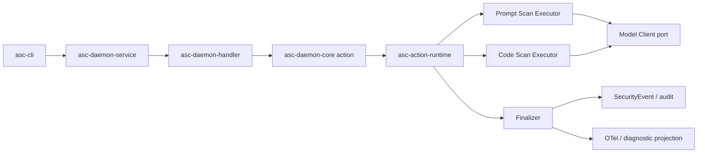

# V2 扫描能力开发指引

本文说明如何在当前 V2 daemon 基础上接入 V1 的 Prompt Scan 和 Code Scan：先建立共享的
Action 合同与执行生命周期，再接入独立的扫描 Capability，通过 daemon RPC 和 Rust CLI
提供调用入口。

| 属性 | 值 |
| --- | --- |
| 文档性质 | 基于当前代码的实施指引；不代表扫描能力已经在 V2 实现或通过验收 |
| 核对日期 | 2026-09-07 |
| 分支基线 | `feat/v2-agentsight-client` |
| 源码基线 | `bc1b6fa4133031b8f4c55076aa2ad65788255577` |
| 范围 | Prompt Scan、Code Scan，以及两者共享的 Action、daemon、事件和 CLI 接入 |
| 路径约定 | 下文模块落点相对于组件根目录 `src/agent-sec-core/` |

## 1. 文档依据与使用方式

目录和接口职责参考
[《AgentSecCore V2 全 Rust Daemon 架构与迁移计划》5.1 节](https://alidocs.dingtalk.com/i/nodes/dpYLaezmVNRMGX56CK0Bo1LZVrMqPxX6)。
仓库已经把 UDS service 和 RPC handler 拆为独立 crate，因此本文保留当前结构，不把它们
重新合并到 `apps/asc-daemon`，也不按目标目录示例重命名已有的 PAP 模块。

开发和验收以仓库内以下材料为依据，不要求开发者能够访问外部文档：

| 材料 | 本任务使用的内容 |
| --- | --- |
| [V2 workspace](../../v2/Cargo.toml)、[README](../../v2/README.md) | 实际成员、依赖、当前实现范围 |
| [Rust 迁移总计划](AGENT_SEC_RUST_MIGRATION_zh.md) | 产品形态、领域边界、迁移与兼容门禁 |
| [Security Actions 参考](SECURITY_ACTIONS_REFERENCE_zh.md) | 第 7、8 节的扫描输入、输出、错误和 verdict |
| [Security Middleware 契约](SECURITY_MIDDLEWARE_CONTRACT_zh.md) | ActionResult、执行生命周期、事件与脱敏 |
| [Daemon 协议契约](DAEMON_PROTOCOL_V1_zh.md) | V1 事实、扫描方法候选、版本化协议与错误层次 |
| [Rust Action Runtime 提案](RUST_SECURITY_CORE_EXECUTION_ARCHITECTURE_zh.md) | executor port、执行监督、finalizer 和可观测性实现建议 |
| [Daemon 进程部署契约](DAEMON_PROCESS_DEPLOYMENT_CONTRACT_zh.md) | 系统级服务、身份、配置、资源归属和 readiness |

本文中的“基线已有”表示核对过的代码事实；“建议新增”表示后续实施位置。新类型名、
文件划分和工作包顺序是实施建议。提案中仍标记为 `[OPEN]` 的 timeout、取消和持久化等
决策，需要进入相应语言无关契约及 executable fixture 后才能作为实现常量。

## 2. 当前代码基线

### 2.1 V2 已有的接入基础

| 已有模块 | 当前作用 | 扫描接入方式 |
| --- | --- | --- |
| `v2/crates/daemon/asc-daemon-service/` | UDS、帧边界、peer credentials、连接限制、dispatch deadline 和 drain | 复用 transport 和 `RequestDispatcher` port |
| `v2/crates/daemon/asc-daemon-protocol/` | 请求/响应 envelope，15 个 PAP method | 增加扫描 method、DTO 和相关协议字段 |
| `v2/crates/daemon/asc-daemon-handler/` | `DaemonDispatcher`、PAP 路由、授权和错误投影 | 增加 Action handler 分支 |
| `v2/crates/daemon/asc-daemon-core/` | `identity.rs`、`pap.rs`，可信 Principal 和 Policy 应用接口 | 增加 Action 用例及扫描权限 |
| `v2/apps/asc-daemon/` | 前台进程、Tokio runtime、PAP 装配、signal/shutdown | 装配 Action Runtime、Executor、Client 和 Sink |
| `v2/crates/foundation/asc-foundation-types/` | `identifier.rs`、`revision.rs` 中的共享值类型 | 按需要复用；扫描专属类型放在 Action 领域 |

当前 `MethodId` 只有 `Pap`，`AccessPolicy` 只有 `PolicyAdministrator`。
`v2/apps/asc-daemon/src/main.rs` 装配的是 `PapService`、编译器和 process-local Repository。
`v2/crates/action/`、`v2/crates/data/`、`v2/apps/asc-cli/` 尚不存在。

具体入口见 [dispatcher.rs](../../v2/crates/daemon/asc-daemon-handler/src/dispatcher.rs)、
[method.rs](../../v2/crates/daemon/asc-daemon-protocol/src/method.rs)、
[identity.rs](../../v2/crates/daemon/asc-daemon-core/src/identity.rs) 和
[main.rs](../../v2/apps/asc-daemon/src/main.rs)。

### 2.2 V1 两种扫描的实现不同

| 能力 | 源码入口 | 迁移方式 |
| --- | --- | --- |
| Prompt Scan | [Rust prompt-scanner](../../agent-sec-cli/crates/prompt-scanner/src/lib.rs)、[Python backend](../../agent-sec-cli/src/agent_sec_cli/security_middleware/backends/prompt_scan.py) | 复用或迁入已有 Rust 引擎，增加 V2 Executor 和结果/审计投影 |
| Code Scan | [Python scanner](../../agent-sec-cli/src/agent_sec_cli/code_scanner/scanner.py)、[Python backend](../../agent-sec-cli/src/agent_sec_cli/security_middleware/backends/code_scan.py) | 移植规则引擎、输入处理、LLM 引擎及结果合同 |
| 模型访问 | [Rust model-service](../../agent-sec-cli/crates/model-service/src/lib.rs)、[Python model_service](../../agent-sec-cli/src/agent_sec_cli/model_service/) | 建立 V2 共享模型 Client，按各消费者的 wire 行为验证 |

V1 Prompt Scan 的 Python backend 通过 PyO3 调用 Rust；V2 直接调用 Rust 能力。
Python/PyO3 只保留为迁移期间的 oracle 或兼容证据，不进入 V2 产品运行时。

## 3. 目标调用链与依赖规则



这是运行时调用关系。Rust crate 依赖还需满足：

- `asc-daemon-protocol` 与 `asc-daemon-core` 不直接依赖彼此；handler 完成二者的适配。
- 公共扫描 request/output 放在 `asc-action-types`；不要为 RPC 再复制一套领域模型和默认值。
- `asc-action-runtime` 定义 `CapabilityExecutor` port，不依赖具体 Capability。
- Capability 依赖 Action 合同、executor port 和所需 Client port，不依赖 daemon-core、
  transport、PAP 或 Policy Compiler。
- `apps/asc-daemon` 装配具体 Executor、模型 Client 和事件 Repository/Sink。
- 扫描返回 verdict 不等于 Hook 已阻断操作，也不等于 AgentSight 已执行内核强制。

## 4. 按依赖添加模块

### 4.1 Action 类型合同

**建议新增：** `v2/crates/action/asc-action-types/`。

| 建议文件 | 内容 |
| --- | --- |
| `src/lib.rs` | 公共导出和领域边界说明 |
| `src/action.rs` | 封闭的 `ActionId`，首批支持 CodeScan、PromptScan |
| `src/code_scan.rs` | Code Scan request/output、language 和 mode 兼容表示 |
| `src/prompt_scan.rs` | Prompt Scan request/output、mode、conversation 输入 |
| `src/result.rs` | 执行状态、业务 verdict、产品错误、兼容结果投影所需的公共合同 |
| `src/context.rs` | 有界的 Action attribution 值类型；不把客户端自报字段升级为可信 Principal |

完整的 `ExecutionContext`、运行时取消句柄和资源策略由 Action Runtime 所有。
daemon-core 将可信身份转换为运行时所需的授权后上下文，避免 runtime 反向依赖 core。
后续增加 Action 时扩展封闭注册；未实现的 Action 不提前对外注册。

### 4.2 安全事件合同

**建议新增：** `v2/crates/data/asc-security-events/`。

先定义事件模型、owner attribution、schema version 和写入 port，可分别放在
`src/event.rs`、`src/repository.rs`。Runtime 的 Finalizer 使用该合同，具体 Capability
只产生经过审核的 audit projection，不直接调用事件 writer。

最小 Action 集成可以用测试 Sink 验证事件投影和失败路径。产品级持久化另见第 8 节；
测试 Sink 不能作为 durable persistence 的证据。

### 4.3 Action Runtime

**建议新增：** `v2/crates/action/asc-action-runtime/`。

| 建议文件 | 内容 |
| --- | --- |
| `src/executor.rs` | `CapabilityExecutor` port、输入校验及显式 audit projector 接口 |
| `src/context.rs` | `ExecutionContext`、deadline/cancellation 和 OTel context |
| `src/runtime.rs` | 封闭注册、Action 调用、准入与执行监督 |
| `src/finalizer.rs` | 统一终态、事件/诊断/OTel 投影与独立 sink 失败处理 |

逻辑接口参考现有 Runtime 提案：`validate(request)`、`execute(context, request)` 和
`project_audit(request, outcome)`。associated types、async/object safety 和 enum dispatch
由工作包选择，不把说明性 trait 签名当作已发布 API。

首版至少保证：

1. transport/binding、Action schema、domain precondition 三层校验各有明确归属。
2. 正常 `warn/deny`、扫描执行失败、core failure 和 transport failure 分层。
3. 已接受的 invocation 由运行时持有；caller timeout 或断连不使执行和最终审计无主。
4. 已路由 invocation 按合同经过唯一 Finalizer，最多产生一个 terminal SecurityEvent；
   事件写入失败可诊断，不伪造已经落盘。
5. 每个 Capability 有显式 audit projector；新增 request 字段默认不进入审计。
6. blocking work 有独立容量和取消边界；超时不等于后台工作已停止。
7. OTel 是技术 TraceId/SpanId 的唯一来源，SecurityEvent 不依赖采样或 exporter 可用性。

先用 fake Executor 和测试 Sink 验证这些行为，再注入真实扫描器。

### 4.4 daemon-core 扫描用例

**建议新增：** `v2/crates/daemon/asc-daemon-core/src/action/`，并从现有 `src/lib.rs` 导出。

该模块接收授权所需的可信 Principal、执行上下文和扫描输入，调用 Action Runtime，返回
应用层结果。可使用一个有界的 Action 应用接口承载两个扫描用例；不需要每个方法再增加
一层纯转发 service，也不把扫描算法放到 core。

扫描调用权限需要单独定义：现有 Policy 管理权限不直接作为扫描权限。handler 根据
method metadata 做入口检查，core 保证直接应用调用也不能绕过授权。角色绑定继续使用
kernel peer credentials 和服务端策略，不能接受请求中的 UID/role 作为授权依据。

### 4.5 protocol 扫描方法族

**修改位置：** `v2/crates/daemon/asc-daemon-protocol/`。

- 新增 `src/action.rs`：扫描方法的 wire DTO 和响应投影合同，复用共享 Action 类型。
- 扩展 `src/method.rs`：增加 Action method identity、精确方法解析和访问元数据。
- 修改 `src/lib.rs`：导出扫描协议模块。
- 按已冻结的协议扩展 `src/envelope.rs`：例如 OTel carrier；不要向现有严格 envelope
  直接发送尚未定义的顶层字段。
- 需要新增错误时扩展现有 `src/response.rs` 的错误合同，保持安全、结构化且有大小限制。

本工作包注册 `action.code_scan` 作为唯一的 code scanner method；
`action.prompt_scan` 仍是未注册的候选名称。该 compatibility slice 冻结
`action.code_scan` 的 method、参数和结果投影，并保持 LocalUser 可调用、由 CLI transport
deadline 限制的边界。Action Runtime、finalizer 与 audit/telemetry sink 仍需在后续工作包
作为完整生命周期一起冻结；不增加接受任意 action name 的通用 RPC。

当前 V2 响应是 `{requestId,result}` 或 `{requestId,error}`。应基于当前协议定义扫描
result 及失败映射，不默认新增 V1/V2 双格式。如果有受支持的 V1 wire consumer，再以
明确兼容范围实现其 projection；不能将 V1 的 `ok/data/stdout/stderr/exit_code` 形状
直接混入当前 PAP 响应。

### 4.6 handler 和 transport 控制传递

**修改位置：** `v2/crates/daemon/asc-daemon-handler/`。

新增 `src/action.rs`，并扩展 `dispatcher.rs` 的构造依赖和 `MethodId` 分支。handler
根据已解析方法选择唯一 Action，经 core 调用一次 Runtime，然后投影响应；业务校验、
模型调用和 Finalizer 不在 handler 重复实现。

当前 `DispatchRequest.control` 已有 deadline/cancellation，但 dispatcher 只在入口检查
`is_cancelled()`，随后 `handle()` 没有把控制信息传给应用。扫描接入需把它转换为应用层
执行控制，传到 core/runtime；不让下层直接依赖 transport 的 `DispatchRequest` 类型。

当前 service 使用 `spawn_blocking` 调用同步 `RequestDispatcher::dispatch()`。
可在保留该 port 的前提下桥接到进程装配的 Runtime，但需约束等待和工作容量，不能为
每次扫描创建 Tokio runtime。是否修改为异步 port 属于后续实现选择，并非接入扫描的
默认前置重构。transport 超时、Action timeout、模型 timeout 的预算关系必须可测试。

### 4.7 产品装配与 Rust CLI

**daemon 修改位置：** `v2/apps/asc-daemon/`。

从 `src/main.rs` 现有 PAP 装配位置增加 Action Runtime、扫描 Executor、Client 和事件
Sink；规模增长时提取装配模块。复用当前进程唯一的 Tokio runtime，增加资源初始化、
配置加载、admission 和 shutdown drain。模型配置应有明确快照和作用域，不通过每次请求
修改进程环境变量来切换模型。模型不可用如何影响某个扫描模式及 daemon readiness，需要
单独定义，不能隐式使其它已有用例不可用。

**CLI 建议新增：** `v2/apps/asc-cli/`。

建议添加 `src/client.rs`、`src/commands/scan_prompt.rs`、`src/commands/scan_code.rs`，
承接 UDS 请求、命令参数、输入读取、输出格式、退出码和 daemon unavailable 错误。
文件/stdin 输入在 CLI 自身权限下读取并发送内容；若要支持 daemon 读取路径，需另行
定义服务器文件访问的授权合同。

`asc-cli` 只调用 daemon，不直接执行扫描、读取事件 SQLite、启动 daemon 或自动本地
fallback。兼容命令名、flag 和 Hook 调用方式以实际消费者盘点为准，不把新 binary
存在等同于原有插件已经完成迁移。

所有新增 crate 使用同一个 `v2/Cargo.toml`、`Cargo.lock` 和共享 target。同步维护
`members`、`workspace.dependencies`、各 crate manifest，并遵循当前 edition/MSRV/lint；
不在 Action 或 Capability 内建立嵌套 workspace。

## 5. Prompt Scan 的具体迁移

**建议新增：** `v2/crates/action/capabilities/asc-capability-prompt-scan/`。

| 当前源码 | 目标内容 |
| --- | --- |
| `agent-sec-cli/crates/prompt-scanner/src/scanner.rs`、`config.rs` | 扫描流程和模式配置 |
| 同 crate 的 `preprocessor.rs`、`detectors/`、`models/` | 预处理、L1 规则、L2 分类和 L4 多轮检测 |
| 同 crate 的 `rules.rs`、`rules/` | 规则加载、内置资源及其来源记录 |
| 同 crate 的 `result.rs`、`verdict.rs`、`error.rs` | 内部结果、聚合和向 Action 合同的显式映射 |
| Python `security_middleware/backends/prompt_scan.py` | 输入兼容和 ActionResult 投影 oracle |
| Python `prompt_scanner/cli.py` | CLI 参数、模型选择、输出及退出码 oracle |

在能力 crate 增加 `src/executor.rs`、`src/audit.rs`。领域内部 scanner result 可以保留，
在边界转换为共享 Action output，不要求把所有引擎内部类型放到 `asc-action-types`。

现有 `PromptScanner::new()` 会内部构造 detector 和模型 client。迁入时需补充注入点，
定义实例复用、并发、初始化计时和配置隔离；不能只给旧构造器套一个 async 函数。
模型 HTTP/config 实现迁入 `v2/crates/integrations/asc-model-client/`；分类 prompt、
模型输出解析和 threat 判定仍归本 Capability。

优先用 `fast` 模式完成第一个真实 Action Slice，然后接入 `standard/strict/multi_turn`。
首个切片必须标记为部分迁移。迁移 Rust 引擎时保留可重现的 V1 oracle 基线和规则资源，
不维持长期分叉的两份算法；移除 Python runtime 依赖也不等于立即退役受支持的外部接口。

## 6. Code Scan 的具体迁移

**建议新增：** `v2/crates/action/capabilities/asc-capability-code-scan/`。

| 当前 Python 文件/目录 | 建议 Rust 落点 | 必须覆盖的行为 |
| --- | --- | --- |
| `code_scanner/scanner.py` | `src/scanner.rs` | 引擎选择、空输入、finding/verdict 聚合和错误映射 |
| `code_scanner/engine/regex_engine.py` | `src/engine/regex.rs` | 普通匹配、命令分段、target 匹配位置、Python 括号换行处理 |
| `code_scanner/engine/code_extractor.py` | `src/engine/code_extractor.rs` | Bash 中内嵌代码识别和 language 转换 |
| `code_scanner/rules/rule_loader.py` | `src/rules.rs` | 文件顺序、YAML 解析、共享引用和规则错误 |
| `code_scanner/rules/bash/`、`python/` | crate 下 `rules/bash/`、`rules/python/` | 规则内容、`_shared.yaml` 和资源打包 |
| `code_scanner/engine/llm_engine.py` | `src/engine/llm.rs` | 请求构造、模型响应解析、finding 和失败语义 |
| `code_scanner/models.py`、`errors.py` | Action 类型及必要的能力内部模型 | language、severity、verdict、结果和错误兼容 |

同时增加 `src/executor.rs`、`src/audit.rs`。先验证 regex，再接 LLM mode；LLM 通过共享
模型 Client port 调用。Python 正则到 Rust 引擎的迁移需用现有规则逐项验证语法与匹配
语义，不能只验证 YAML 能加载。

现有测试语料包括
[Code Scanner 单元测试](../../tests/unit-test/code_scanner/)、
[backend 测试](../../tests/unit-test/security_middleware/backends/test_code_scan_backend.py)
和 [CLI E2E](../../tests/e2e/code-scanner/e2e_test.py)。复用其有效场景，比较完整 finding、
evidence、顺序和结果投影，而非只比较最终 verdict。

## 7. 必须保留或显式版本化的扫描语义

以下是当前 V1 输入/结果事实，详细合同以 `SECURITY_ACTIONS_REFERENCE_zh.md` 为准。

| 项目 | Prompt Scan | Code Scan |
| --- | --- | --- |
| 输入 | `text`、`mode`、`source`、`model`；多轮还包含 `history`、`assistant_response` | `code`、`language`、`mode` |
| 默认模式 | `standard`；模式不区分大小写 | `regex`；仅恰好 `llm` 进入 LLM 路径 |
| 模式/语言 | `fast/standard/strict/multi_turn` | language 恰好 `bash/python`；当前其它 mode 值走 regex 兼容路径 |
| 未知 Action 字段 | 当前忽略 | 当前忽略 |
| 正常 verdict | `pass/warn/deny`，Action 执行成功、退出码 0 | `pass/warn/deny`，正常扫描执行成功、退出码 0 |
| `data.ok` | 表示是否无 threat；正常 deny 可以为 false | 表示扫描执行是否成功；正常 deny 可以为 true |
| 执行失败 | 空输入、非法 mode、引擎/模型错误分别投影 | 空输入、非法 language、规则/模型错误分别投影 |

不要直接使用 `data.ok` 作为两个能力共享的执行成功判断，也不要把 `deny` 投影成 daemon
internal error。`verdict=error` 表示扫描执行失败，不能解释为已经检测到高风险或扫描安全。
Prompt 的 `degraded`、`layers_failed`、截断和计时字段应与当前 schema 一起验证。

三层校验分别落地：wire envelope/DTO 由协议边界处理；Action 字段默认值、枚举和
cross-field 校验由共享 Action schema/decoder 所有；模型、规则和其它资源前置条件由
Capability 处理。schema error 落在哪一层响应中，按 oracle 和选定 wire version 冻结，
不能让 Serde 的默认行为无意改变外部错误合同。

## 8. 公共依赖与后续扩展边界

| 模块 | 何时需要 | 内容和位置 |
| --- | --- | --- |
| `asc-model-client` | 接入 Prompt 模型模式或 Code LLM mode 时 | `v2/crates/integrations/asc-model-client/`；共享 HTTP、连接、超时、重试和配置校验。保留当前本地模型访问边界，并测试构造/注入路径 |
| `asc-evidence-types` | 扫描结果有 PIP/Decision 等跨领域消费者时 | `v2/crates/action/asc-evidence-types/`；Evidence/Attribute 合同和受控 projector；不直接把完整扫描 JSON 送入 PDP |
| `asc-persistence-sqlite`、`asc-sqlite-kernel` | 需要真实安全事件保留和重启后恢复时 | `v2/crates/data/persistence/asc-sqlite-kernel/`（与领域无关的连接、schema 收敛、写入阶梯、维护闸门）与 `v2/crates/data/persistence/asc-persistence-sqlite/src/{security_events,observability}/`（各自的 `table`/`repository`/`policy`/`migration`/`writer`/`reader`）。两条流的表契约、故障策略和迁移机制都不同，因此按流分目录而非合并为单个 `events.rs`；实现事件 port，验证真实存储和恢复 |
| `asc-observability`、`asc-session`、`asc-event-log`、`asc-event-sink`、`asc-security-summary` | 需要授权事件查询、session 关联和读模型时 | `v2/crates/data/`；由 daemon query 用例提供访问，不由 CLI 直读数据库。JSONL 落盘、双写装配与摘要渲染已分别落在 `asc-event-log`、`asc-event-sink`、`asc-security-summary`；`asc-session` 尚未实现 |
| config/packaging/deploy | 从集成切片进入产品交付时 | `v2/config/`、`v2/packaging/`、`v2/deploy/`；规则资产、模型配置、系统路径、身份和启动就绪合同 |

独立扫描 RPC 不要求先实现 Policy Runtime、PAP 扩展、PCP/Reconciler 或 AgentSight
规则下发。最小事件路径也不要求先完成整个 trajectory 系统。事件工作包已定案上述
三个待定项（详见
[《V2 数据持久化层迁移设计》](V2_DATA_PERSISTENCE_MIGRATION_zh.md) §2）：兼容 V1 JSONL +
SQLite 双写（是，且是文件级兼容，唯一分歧是 JSONL 的 key 顺序）；保留期沿用 v1
（`security_events` 30 天 / `observability` 7 天）；sink deadline 本次不引入，引入会
改变可观测行为而破坏迁移等价性，将来应加在 daemon 侧的 `spawn_blocking` 包装上。

若扫描接入改变任一 Agent Hook 的环境变量、默认值或行为，同一 PR 同步 capability
view、对应文档和合同测试，遵循组件 `AGENTS.md`。只有明确受影响的 Hook 才纳入该变更。

## 9. 推荐工作包与集成顺序

工作包按直接依赖启动。以下顺序用于组织交付，不要求先完成所有 Scanner 再开发 daemon。

| 工作包 | 直接依赖 | 交付及直接消费者证据 |
| --- | --- | --- |
| A：Action/事件合同和扫描 oracle | 当前 V1 源码、行为契约 | 两种扫描的 schema、结果/事件 fixture；Runtime 和协议消费者可引用 |
| B：Action Runtime | A 的 Action/事件 port | fake Executor 下的准入、错误、取消、Finalizer 和 Sink 测试 |
| C：core/protocol/handler | A；联调使用 B 的最小实现 | 显式 RPC、扫描授权、执行控制、响应映射；真实 UDS + fake Executor |
| D：Prompt Capability | A、B 的 executor port；模型模式另依赖模型 Client | Rust 引擎迁移；先 fast，后完整模式；Runtime 直接消费者测试 |
| E：Code Capability | A、B 的 executor port；LLM 另依赖模型 Client | regex/LLM 迁移和完整结果差分；Runtime 直接消费者测试 |
| F：daemon/CLI 与真实 Action Slice | B、C 和任一真实 Capability | 真实 binary + CLI/UDS + 扫描 + 事件；记录实际模式和 Sink 类型 |
| G：持久化与交付 | 事件合同、F；所需配置/部署合同 | 真实存储、重启恢复、多 UID、资源打包及部署证据 |

推荐第一条可验收路径为 A → B/C → Prompt fast → F，再分别补齐模型模式和 Code Scan。
C、D、E 可以在各自直接依赖稳定后推进。仅完成 fast/regex 需要报告
`PARTIAL_EQUIVALENCE`，不能声明 V1 扫描完整迁移。

每个 owner 在开始实现时记录源码 baseline、直接依赖 revision、V1 relationship 和
acceptance type，盘点实际消费者，提出本工作包的兼容范围和验收样本。局部未决事项只
阻塞相关工作包和直接消费者，不建立全局冻结门槛。

## 10. 测试落点与完成标准

### 10.1 测试和 fixture 放置

| 层次 | 建议位置 | 验证内容 |
| --- | --- | --- |
| 类型、Runtime、Capability | 各新增 crate 的 `tests/`，或必要的源码单元测试 | schema、差分、执行状态、事件和资源边界 |
| 协议 | `v2/crates/daemon/asc-daemon-protocol/tests/fixtures/` 及 `tests/` | 精确 wire request/response、非法输入和显式方法集合 |
| 跨进程 | `v2/apps/asc-daemon/tests/` | 实际 binary、UDS、权限、并发、超时、断连和 shutdown |
| CLI | `v2/apps/asc-cli/tests/` | 参数、stdin/文件输入、输出和退出码、daemon 不可用 |
| 共享扫描 golden | `v2/fixtures/actions/prompt-scan/`、`code-scan/` | V1 冻结输入、完整输出及必要的事件和调用 trace |
| 模型 Client | `v2/crates/integrations/asc-model-client/tests/` | 真实序列化请求、响应、超时、重试、地址限制和失败映射 |

已有 Prompt 测试来源包括
[Rust Scanner 测试及语料](../../agent-sec-cli/crates/prompt-scanner/)、
[backend 测试](../../tests/unit-test/security_middleware/backends/test_prompt_scan_backend.py)
和 [Prompt CLI E2E](../../tests/e2e/prompt-scanner/test_prompt_scanner_e2e.py)。
采用 oracle 或 frozen golden，记录动态字段的比较规则，例如 UUID、时间与耗时；不能
通过忽略整个 result 来消除差异。退役 V1 后保留当前 V2 conformance，无需永久运行 V1。

### 10.2 验收证据清单

以下是待实现、待记录的检查项，不是已有 PASS 结果：

- supported 模式、默认值、未知字段、空输入、非法枚举、完整结果和退出码均有证据。
- `pass/warn/deny/error` 与执行成功、daemon response 的分层得到验证。
- 模型不可达、响应不可解析、规则错误和扫描不完整得到准确投影。
- 可信 Principal、独立扫描权限和客户端 attribution 不提权得到验证。
- 并发慢扫描不会饿死其它用例；超时、断连、shutdown 的执行所有权和事件尝试可验证。
- audit projector 不泄露未经允许的原文或错误链；OTel sampling/exporter 故障不吞掉安全事件。
- mock 模型、测试 Sink、真实模型和真实持久化分别记录证据，未执行项标记 `NOT RUN`。
- 现有 PAP 方法和 UDS 合同回归通过；新增 Capability 不影响已有授权范围和响应格式。

从组件根目录进入 `v2/`，运行实际新增 package 的针对性测试，再执行适用的 workspace
门禁。以下是仓库现有工具命令，不代表执行本文即已有扫描测试：

```bash
cd v2
cargo test --workspace --locked
cargo clippy --workspace --all-targets --locked -- -D warnings
cargo fmt --all -- --check
cargo doc --workspace --no-deps --locked
git diff --check
```

每个工作包交付 executable pass/fail matrix、外部兼容报告、内部合同变更记录、直接消费者
证据和回滚步骤。使用测试 Sink 的 Action Slice 只证明应用链与事件合同；真实存储的
验收需另行验证落盘和重启，真实模型的验收需另行记录模型、配置与环境。

### 10.3 需要随实现冻结的决策与回滚

开始相关模块前，至少定案：扫描 method/权限/响应版本、每模式 timeout 和容量、断连后的
执行行为、Action schema error 的响应层、模型配置归属、事件原文保留和 Sink 失败语义。
选择需同步到前述仓库契约和 executable fixture；本指引不预设这些具体取值。

回滚以独立工作包为单位：记录旧 binary/config 的可复现版本、调用方兼容范围和恢复步骤。
新增扫描注册或装配回滚时保留已生成的事件；如引入 SQLite schema，先明确旧版本能否
读取，不能默认可以降级。回滚不通过 Python fallback 完成，也不静默退役受支持的接口。
