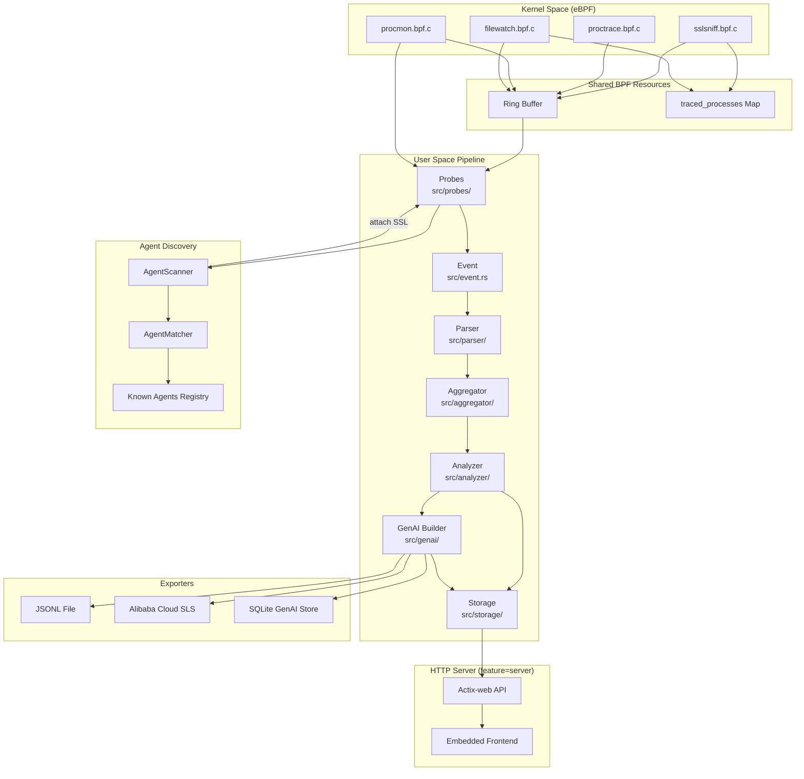
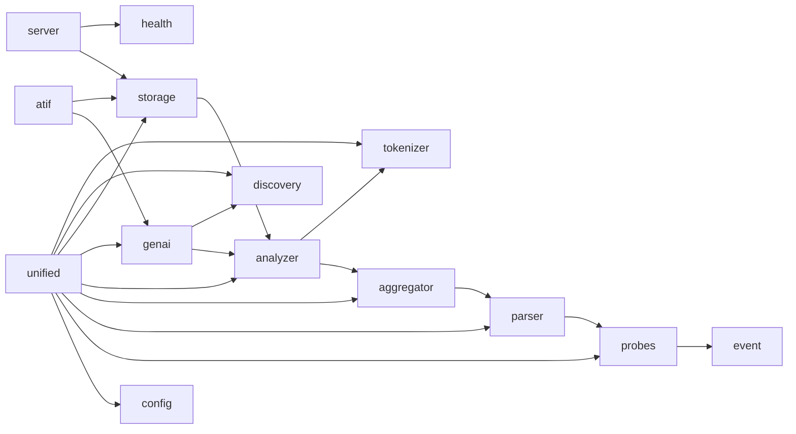
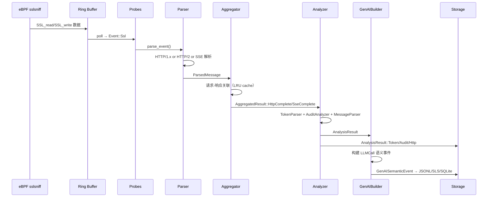

# Architecture — AgentSight

## System Overview

AgentSight 是一个 eBPF 驱动的 AI Agent 可观测性系统，通过内核态探针无侵入地捕获 LLM API 交互，经用户态流水线处理后持久化到 SQLite 或导出到阿里云 SLS。



## Layer Architecture

| Layer | 模块 | 职责 | 依赖方向 |
|-------|------|------|----------|
| **L0: Kernel** | `src/bpf/` | eBPF C 程序，内核态数据采集 | 无内部依赖 |
| **L1: Capture** | `src/probes/`, `src/event.rs` | 探针加载、事件轮询、统一事件类型 | → L0 |
| **L2: Parse** | `src/parser/` | HTTP/1.x, HTTP/2, SSE, ProcTrace 协议解析 | → L1 |
| **L3: Aggregate** | `src/aggregator/` | 请求-响应关联、进程生命周期聚合 | → L2 |
| **L4: Analyze** | `src/analyzer/`, `src/tokenizer/` | Token 提取、审计记录、消息解析 | → L3 |
| **L5: Semantic** | `src/genai/`, `src/atif/` | 语义事件构建、轨迹格式导出 | → L4 |
| **L6: Persist** | `src/storage/` | SQLite 持久化、SLS 远程导出 | → L4, L5 |
| **L7: Serve** | `src/server/`, `src/health/` | HTTP API、前端、健康检查 | → L6 |
| **L8: Entry** | `src/bin/`, `src/unified.rs`, `src/config.rs` | CLI 入口、编排器、配置 | → L1-L7 |
| **Cross** | `src/discovery/` | Agent 进程发现与匹配 | 被 L1, L8 使用 |

## Module Dependency Graph



## Data Flow: SSL Capture to Storage

这是最核心的端到端数据流：



## Key Design Decisions

### 1. Shared Ring Buffer + Shared BPF Map

`Probes` 管理器让 sslsniff、proctrace、procmon、filewatch 四个探针共享同一个 ring buffer 和 `traced_processes` BPF map。这减少了内核-用户空间的数据拷贝开销，并确保所有探针对 PID 过滤达成一致。

**实现**: `src/probes/probes.rs:Probes::new()` — proctrace 创建 map 和 ring buffer，其他探针通过 handle 复用。

### 2. Agent Auto-Discovery via ProcMon

系统启动时 `AgentScanner` 扫描 `/proc` 发现已运行的 Agent，运行时通过 procmon 的 `Exec`/`Exit` 事件动态追踪 Agent 生命周期。发现新 Agent 后自动 attach SSL 探针。

**实现**: `src/unified.rs:AgentSight::handle_procmon_event()` — 由 ProcMon 事件驱动，调用 `AgentScanner::on_process_create()`。

### 3. Dual Export Path: AnalysisResult vs GenAISemanticEvent

`Analyzer` 输出原始 `AnalysisResult`（Token/Audit/Http），`GenAIBuilder` 将其转换为高抽象的 `GenAISemanticEvent`（LLMCall/ToolUse/AgentInteraction）。两条路径独立存储，前者用于本地查询，后者用于远程导出和语义分析。

**实现**: `src/unified.rs:AgentSight::try_process()` 第 287-309 行。

### 4. Compile-Time Frontend Embedding

`dashboard/` 构建产物通过 `include_dir!` 宏在编译时嵌入到 Rust 二进制中，运行时无需额外静态文件。通过 feature flag `server` 控制。

**实现**: `src/server/mod.rs` — `static FRONTEND: Dir = include_dir!("$CARGO_MANIFEST_DIR/frontend-dist");`

### 5. Pluggable GenAI Exporters

`GenAIExporter` trait 定义了导出接口，当前实现：JSONL 文件（默认）、SQLite GenAI Store、阿里云 SLS Uploader。可通过 `AgentSight::add_genai_exporter()` 运行时注册。

**实现**: `src/genai/exporter.rs` — `trait GenAIExporter`，`src/unified.rs:AgentSight::new()` 第 122-149 行。

## File Structure

```
src/
├── lib.rs                 # 库入口，re-exports 所有公共类型
├── unified.rs             # AgentSight 主编排器
├── config.rs              # AgentsightConfig 配置结构
├── event.rs               # Event 统一枚举
├── chrome_trace.rs        # Chrome Trace 导出
├── ffi.rs                 # FFI 绑定
├── bpf/                   # eBPF C 程序 + vmlinux 头文件
│   ├── common.h           # 共享常量（event_source_t）
│   ├── sslsniff.bpf.c     # SSL 探针
│   ├── proctrace.bpf.c    # 进程追踪探针
│   ├── procmon.bpf.c      # 进程监控探针
│   ├── filewatch.bpf.c    # 文件监控探针
│   └── *.h                # BPF 数据结构头文件
├── probes/                # 用户态探针管理
│   ├── probes.rs          # Probes 统一管理器
│   ├── sslsniff.rs        # SslSniff 封装
│   ├── proctrace.rs       # ProcTrace 封装
│   ├── procmon.rs         # ProcMon 封装
│   └── filewatch.rs       # FileWatch 封装
├── parser/                # 协议解析
│   ├── unified.rs         # Parser 统一入口
│   ├── http/              # HTTP/1.x 解析
│   ├── http2/             # HTTP/2 解析
│   ├── sse/               # SSE 解析
│   └── proctrace.rs       # ProcTrace 事件解析
├── aggregator/            # 事件聚合
│   ├── unified.rs         # Aggregator 统一入口
│   ├── http/              # HTTP 请求-响应关联
│   ├── http2.rs           # HTTP/2 流聚合
│   └── proctrace/         # 进程生命周期聚合
├── analyzer/              # 数据分析
│   ├── unified.rs         # Analyzer 统一入口
│   ├── audit/             # 审计记录生成
│   ├── token/             # Token 使用提取
│   └── message/           # LLM API 消息解析（OpenAI/Anthropic）
├── genai/                 # GenAI 语义层
│   ├── builder.rs         # GenAIBuilder（AnalysisResult → GenAISemanticEvent）
│   ├── semantic.rs        # 语义数据结构（LLMCall, ToolUse 等）
│   ├── exporter.rs        # GenAIExporter trait
│   ├── storage.rs         # JSONL 本地存储
│   └── sls.rs             # 阿里云 SLS 上传
├── storage/               # 持久化
│   ├── unified.rs         # Storage 统一门面
│   └── sqlite/            # SQLite 实现
│       ├── audit.rs       # AuditStore
│       ├── token.rs       # TokenStore
│       ├── http.rs        # HttpStore
│       ├── genai.rs       # GenAISqliteStore（会话/trace/时序查询）
│       └── token_consumption.rs  # Token 消耗明细
├── discovery/             # Agent 发现
│   ├── agent.rs           # AgentInfo, DiscoveredAgent
│   ├── matcher.rs         # AgentMatcher trait + ProcessContext
│   ├── registry.rs        # 内置 Agent 注册表
│   ├── scanner.rs         # /proc 扫描器
│   └── agents/            # 具体 Agent 匹配器（Cosh, OpenClaw）
├── health/                # 健康检查
│   ├── checker.rs         # HealthChecker（后台定期检查）
│   ├── port_detector.rs   # TCP 端口检测
│   └── store.rs           # HealthStore（AgentHealthState）
├── tokenizer/             # Token 计数
│   ├── llm_tok.rs         # LlmTokenizer（llm-tokenizer 封装）
│   ├── model_mapping.rs   # 模型名 → HuggingFace ID 映射
│   └── multi_model.rs     # MultiModelTokenizer（多模型支持）
├── atif/                  # ATIF 轨迹格式
│   ├── schema.rs          # ATIF v1.6 数据结构
│   └── converter.rs       # GenAI → ATIF 转换
├── server/                # HTTP 服务器（feature=server）
│   ├── mod.rs             # Actix-web 服务器 + 前端嵌入
│   └── handlers.rs        # API 处理函数
└── bin/                   # 二进制入口
    ├── agentsight.rs      # 主 CLI（trace/serve/token/audit/discover/metrics）
    └── cli/               # 各子命令实现
        ├── trace.rs
        ├── serve.rs
        ├── token.rs
        ├── audit.rs
        ├── discover.rs
        └── metrics.rs
```
