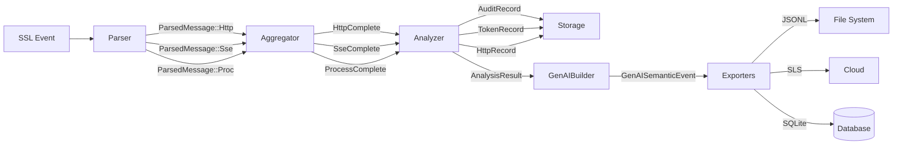

# Data Pipeline Design — AgentSight

## Overview

AgentSight 的核心是一条从 eBPF 探针到持久化的数据流水线，每层职责明确、数据单向流动：

```
Probes → Parser → Aggregator → Analyzer → GenAI → Storage
```

## Pipeline Stages

### Stage 1: Event Capture (Probes)

**Input**: Kernel eBPF events
**Output**: `Event` enum

```rust
pub enum Event {
    Ssl(SslEvent),       // SSL plaintext data
    Proc(ProcEvent),     // Process execve event
    ProcMon(ProcMonEvent), // Process create/exit
    FileWatch(FileWatchEvent), // File open
}
```

**Implementation**: `src/probes/probes.rs` — single thread polls shared ring buffer, dispatches by `event_source_t`.

### Stage 2: Protocol Parsing (Parser)

**Input**: `Event` (mainly `Event::Ssl`)
**Output**: `ParseResult` (0 or more `ParsedMessage`)

```rust
pub enum ParsedMessage {
    Http(ParsedHttpMessage),  // HTTP/1.x request or response
    Http2(ParsedHttp2Frame),  // HTTP/2 frame
    Sse(ParsedSseEvent),      // SSE event
    Proc(ParsedProcEvent),    // Process event
}
```

**Parsing strategy**:
- `HttpParser`: State machine parsing HTTP/1.x request line/status line/headers/body
- `Http2Parser`: Decodes HTTP/2 frames (HEADERS, DATA, SETTINGS, etc.)
- `SseParser`: Parses SSE `data: ` lines as JSON
- `ProcTraceParser`: Parses execve event command line args

**Unified entry**: `Parser::parse_event()` — routes to corresponding parser by Event type.

**Source**: `src/parser/unified.rs`

### Stage 3: Event Aggregation (Aggregator)

**Input**: `ParseResult`
**Output**: `Vec<AggregatedResult>`

```rust
pub enum AggregatedResult {
    HttpComplete(HttpPair),       // HTTP request-response pair
    SseComplete(SsePair),         // HTTP request + SSE stream response
    RequestOnly { request, .. },  // Timeout, no response received
    ResponseOnly { response, .. },// No matching request
    ProcessComplete(AggregatedProcess), // Process lifecycle complete
    Http2StreamComplete(Http2Stream),   // HTTP/2 stream complete
    Http2Frames { .. },           // HTTP/2 frame sequence
}
```

**Correlation strategy**:
- **HTTP/1.x**: Match request and response via (pid, fd) LRU connection cache
- **HTTP/2**: Aggregate frames by stream ID
- **SSE**: HTTP request + subsequent SSE event stream, ended by `[DONE]` marker
- **Process**: Aggregate exec/exit events into complete lifecycle

**Timeout handling**: Unmatched request/response output as RequestOnly/ResponseOnly after timeout.

**Source**: `src/aggregator/unified.rs`

### Stage 4: Analysis (Analyzer)

**Input**: `AggregatedResult`
**Output**: `Vec<AnalysisResult>`

```rust
pub enum AnalysisResult {
    Audit(AuditRecord),        // Audit record
    Token(TokenRecord),        // Token usage record
    Http(HttpRecord),          // HTTP data record
    Message(ParsedApiMessage), // Parsed API message
}
```

**Analysis flow**:
1. **Process events** → directly generate `AuditRecord`
2. **HTTP events** → parallel execution:
   - `AuditAnalyzer` → generates audit records (LLM calls, HTTP request summary)
   - `TokenParser` → extracts token usage from SSE events (reverse search, first match)
   - `HttpRecord` extraction → raw HTTP data export
3. **Manual Token Computation** → if no token data in SSE, uses `MultiModelTokenizer` + chat template to compute

**Source**: `src/analyzer/unified.rs`

### Stage 5: GenAI Semantic Build (GenAI Builder)

**Input**: `Vec<AnalysisResult>`
**Output**: `Vec<GenAISemanticEvent>`

```rust
pub enum GenAISemanticEvent {
    LLMCall(LLMCall),              // Complete LLM call
    ToolUse(ToolUse),              // Tool invocation
    AgentInteraction(AgentInteraction), // Agent interaction
    StreamChunk(StreamChunk),      // Streaming response chunk
}
```

**Build strategy**:
- `LLMCall`: Extract request messages from HTTP request, output messages from SSE response
- Agent name resolution: Map PID/comm to known Agent name via `AgentMatcher`
- Unique ID generation: Based on session_prefix + AtomicU64 counter

**Export**: After building, export via `GenAIExporter` trait to multiple backends:
- `GenAIStore` → local JSONL file
- `GenAISqliteStore` → SQLite database
- `SlsUploader` → Alibaba Cloud SLS

**Source**: `src/genai/builder.rs`

### Stage 6: Persistence (Storage)

**Input**: `AnalysisResult` + `GenAISemanticEvent`
**Output**: SQLite tables / SLS logs / JSONL files

**SQLite table structure**:

| Store | Table | Content |
|-------|-------|---------|
| AuditStore | audit_events | Audit events |
| TokenStore | token_records | Token usage records |
| HttpStore | http_records | Raw HTTP data |
| TokenConsumptionStores | token_consumption | Token consumption breakdown |
| GenAISqliteStore | genai_events | GenAI semantic events |

**Source**: `src/storage/unified.rs`, `src/storage/sqlite/`

## Data Flow Diagram



## Error Handling

The pipeline adopts a lenient error handling strategy:
- **Probe layer**: Ring buffer poll errors terminate the poll thread, but the main thread does not exit
- **Parser layer**: Parse failures silently ignored, returns empty `ParseResult`
- **Aggregator layer**: Timed-out unmatched events output as RequestOnly/ResponseOnly
- **Analyzer layer**: Token extraction failure tries manual computation, then skips
- **Storage layer**: Storage failures only log::warn, don't block the pipeline

**Design principle**: The data pipeline never stops due to intermediate layer errors; single event failure doesn't affect other events.

## Backpressure

No explicit backpressure mechanism currently:
- Ring buffer managed by kernel, discards old events on overflow
- crossbeam channel uses unbounded mode
- Main loop sleeps 10ms when idle, natural rate limiting

**Potential improvement**: For high-load scenarios, introduce bounded channel + backpressure signaling.
