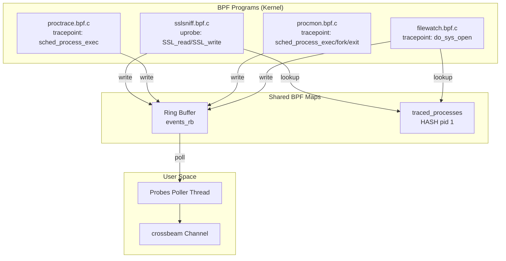

# eBPF Probes Design — AgentSight

## Overview

AgentSight 使用 4 个 eBPF 探针从内核态捕获数据，所有探针共享同一个 ring buffer 和 `traced_processes` BPF map，由 `Probes` 管理器统一协调。

## Probe Architecture

## Probe Details

### 1. sslsniff — SSL/TLS Traffic Capture

- **BPF Type**: uprobe
- **Attach Point**: `SSL_read` / `SSL_write` (OpenSSL/BoringSSL)
- **Filter**: Only capture PIDs in `traced_processes` map
- **Output**: `probe_SSL_data_t` struct (pid, timestamp, fd, data, len, comm)
- **Source**: `src/bpf/sslsniff.bpf.c`, `src/bpf/sslsniff.h`
- **Userspace**: `src/probes/sslsniff.rs`

**How it works**:
1. Userspace calls `SslSniff::attach_process(pid)` to attach SSL uprobe to target process's libssl.so
2. When target process calls SSL_read/SSL_write, BPF program captures decrypted plaintext
3. Data is passed to userspace via ring buffer, parsed as `SslEvent`

**Key design**: Dynamic attach — probes are not attached at startup, but on-demand after Agent process discovery.

### 2. proctrace — Process Command Line Tracing

- **BPF Type**: tracepoint
- **Attach Point**: `sched_process_exec`
- **Filter**: None (captures all execve events)
- **Output**: `VariableEvent` (variable-length: pid, ppid, comm, args)
- **Source**: `src/bpf/proctrace.bpf.c`, `src/bpf/proctrace.h`
- **Userspace**: `src/probes/proctrace.rs`

**Key design**: Variable-length events — execve command line args have variable length, using `common_event_hdr` + `proc_event_header` + variable-length args format.

### 3. procmon — Process Lifecycle Monitor

- **BPF Type**: tracepoint
- **Attach Point**: `sched_process_exec`, `sched_process_fork`, `sched_process_exit`
- **Filter**: None
- **Output**: `procmon_event_t` (Exec/Fork/Exit events)
- **Source**: `src/bpf/procmon.bpf.c`, `src/bpf/procmon.h`
- **Userspace**: `src/probes/procmon.rs`

**Purpose**: Drives Agent auto-discovery. When a new process is created, checks if it's a known Agent and auto-attaches SSL probes.

### 4. filewatch — File Open Monitor

- **BPF Type**: tracepoint
- **Attach Point**: `do_sys_open` / `do_sys_openat2`
- **Filter**: Only monitor PIDs in `traced_processes` map opening `.jsonl` files
- **Output**: `filewatch_event_t` (pid, filename)
- **Source**: `src/bpf/filewatch.bpf.c`, `src/bpf/filewatch.h`
- **Userspace**: `src/probes/filewatch.rs`

**Purpose**: Monitor Agent processes opening .jsonl files for auxiliary Agent session identification.

## Shared Resource Design

### Ring Buffer (events_rb)

All probes share one ring buffer, distinguished by `common_event_hdr.source` field:

| source value | Event type | Parse method |
|-------------|-----------|-------------|
| 1 (EVENT_SOURCE_PROC) | proctrace event | `VariableEvent::from_bytes()` |
| 2 (EVENT_SOURCE_SSL) | sslsniff event | `SslEvent::from_bpf()` |
| 3 (EVENT_SOURCE_PROCMON) | procmon event | `procmon::Event::from_bytes()` |
| 4 (EVENT_SOURCE_FILEWATCH) | filewatch event | `FileWatchEvent::from_bytes()` |

**Implementation**: `src/probes/probes.rs:Probes::run()` lines 137-193 — single thread polls ring buffer, dispatches by source field into `Event` enum.

### traced_processes Map

BPF hash map, key=PID, value=1. Used by:
- sslsniff: Only capture SSL traffic from traced processes
- filewatch: Only monitor file opens from traced processes

**Dynamic update**: `Probes::add_traced_pid()` / `Probes::remove_traced_pid()` at runtime.

## Build-Time Code Generation

`build.rs` uses `libbpf-cargo` at compile time to:
1. Compile `src/bpf/*.bpf.c` to BPF bytecode
2. Generate Rust skeleton files (auto-load, map access, etc.)
3. Generate vmlinux type bindings via `bindgen`

**Dependencies**: `build-dependencies` in Cargo.toml: `libbpf-cargo`, `bindgen`, `cc`.

## Performance Considerations

1. **Single poll thread**: One background thread polls ring buffer, dispatches via crossbeam channel
2. **LRU cache**: HTTP connection aggregation uses LRU cache (default 24 entries) to prevent unbounded memory growth
3. **PID filtering**: BPF-side filtering, only uploads data from traced processes, reducing kernel-userspace data copy
4. **Non-blocking**: `Probes::try_recv()` is non-blocking, main loop sleeps 10ms when idle
