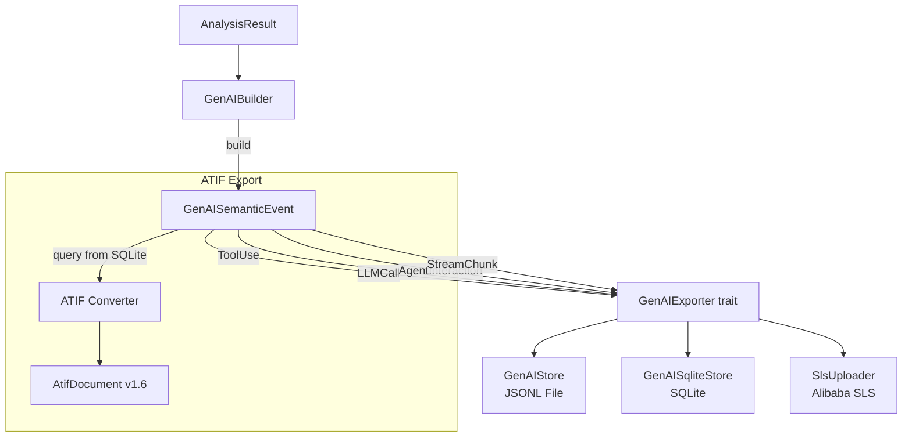
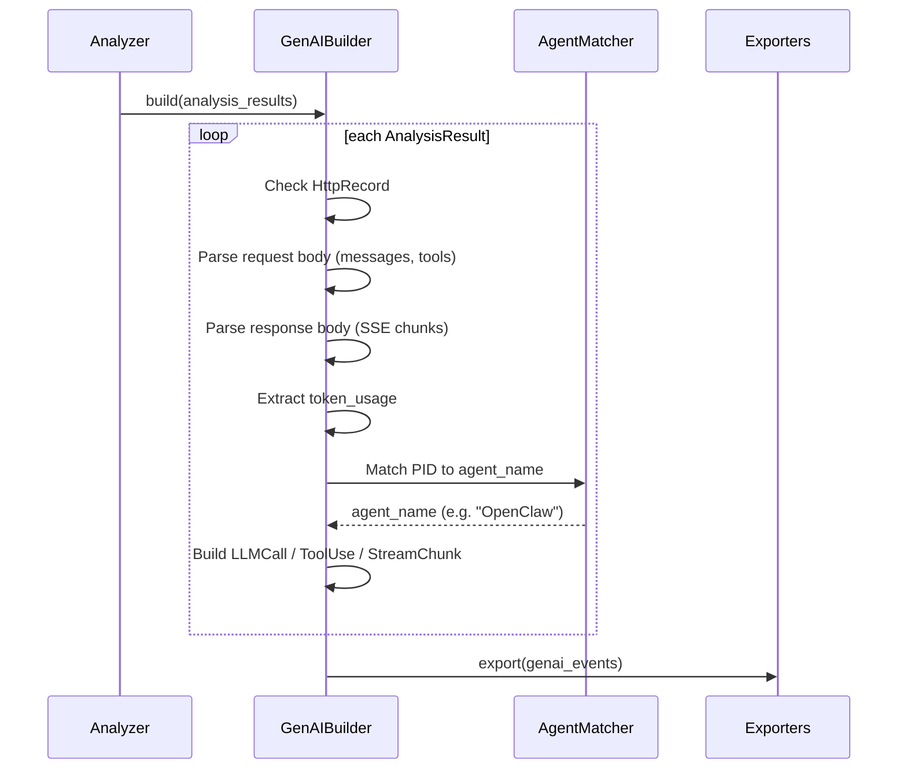

# GenAI Semantic Layer Design — AgentSight

## Overview

The GenAI semantic layer is AgentSight's "understanding" layer, transforming raw HTTP/SSL data into structured LLM interaction semantic events, supporting multi-channel export (JSONL, SQLite, SLS) and standardized trajectory format (ATIF) export.

## Architecture



## Core Types

### GenAISemanticEvent

Four semantic event types:

| Type | Meaning | Trigger condition |
|------|---------|-------------------|
| `LLMCall` | Complete LLM API call | HTTP request + SSE/HTTP response |
| `ToolUse` | Tool/function invocation | SSE response contains tool_calls |
| `AgentInteraction` | Agent interaction/decision | Reasoning/planning intermediate steps |
| `StreamChunk` | Streaming response chunk | Each chunk in SSE stream |

### LLMCall Structure

`LLMCall` is the most critical semantic type:

```
LLMCall
├── call_id: String           # Unique ID (session_prefix + counter)
├── start_timestamp_ns: u64   # Request time
├── end_timestamp_ns: u64     # Response time
├── duration_ns: u64          # Latency
├── provider: String          # openai / anthropic
├── model: String             # gpt-4, claude-3, etc.
├── request: LLMRequest       # Request details
│   ├── messages: Vec<InputMessage>  # Input messages
│   ├── tools: Option<Vec<ToolDefinition>>  # Tool definitions
│   └── stream: bool          # Stream mode
├── response: LLMResponse     # Response details
│   ├── messages: Vec<OutputMessage>  # Output messages
│   └── streamed: bool        # Was streamed
├── token_usage: Option<TokenUsage>  # Token stats
├── agent_name: Option<String>  # Resolved Agent name
└── pid: i32                  # Process ID
```

### MessagePart (OTel Compatible)

Message content uses OpenTelemetry GenAI parts-based format:

| Part type | Purpose |
|-----------|---------|
| `Text` | Plain text content |
| `Reasoning` | Reasoning/thinking content (e.g., Claude thinking) |
| `ToolCall` | Tool call request from model |
| `ToolCallResponse` | Tool call return result |

## GenAIBuilder Build Flow



**Source**: `src/genai/builder.rs`

## Agent Name Resolution

`GenAIBuilder` resolves process PID/comm to known Agent names via `AgentMatcher`:

1. Build `ProcessContext { pid, comm, cmdline }`
2. Iterate through all matchers in `known_agents()` registry
3. First matching matcher provides agent_name

**Known Agents**: Cosh (`src/discovery/agents/cosh.rs`), OpenClaw (`src/discovery/agents/openclaw.rs`)

**Custom extension**: Implement `AgentMatcher` trait to add new Agent matchers.

## GenAIExporter Trait

```rust
pub trait GenAIExporter: Send + Sync {
    fn export(&self, events: &[GenAISemanticEvent]);
    fn name(&self) -> &str;
}
```

### Implementation Comparison

| Exporter | Storage | Format | Use case |
|----------|---------|--------|----------|
| `GenAIStore` | Local JSONL file | One JSON per line | Default, simple debugging |
| `GenAISqliteStore` | SQLite genai_events table | Structured SQL | Local queries, Dashboard |
| `SlsUploader` | Alibaba Cloud SLS | Protobuf | Cloud centralization, large-scale deployment |

**Export strategy**: JSONL + SQLite enabled by default; SLS enabled when environment variables configured.

**Runtime registration**: `AgentSight::add_genai_exporter()` allows dynamic exporter addition.

## ATIF Export

ATIF (Agent Trajectory Interchange Format) v1.6 is a standardized Agent trajectory format, independent from the GenAI semantic layer:

```mermaid
graph LR
    DB[(SQLite genai_events)] --> CONV[ATIF Converter]
    CONV --> DOC[AtifDocument]
    DOC --> API[/api/export/atif/...]
```

- **By trace**: `/api/export/atif/trace/{trace_id}`
- **By session**: `/api/export/atif/session/{session_id}`

**ATIF structure**: `AtifAgent` → `Vec<AtifStep>` → `AtifToolCall` + `AtifObservation`

**Source**: `src/atif/converter.rs`, `src/atif/schema.rs`

## Session & Trace Model

The GenAI semantic layer introduces session and trace concepts:

| Concept | Identifier | Lifecycle |
|---------|-----------|-----------|
| **Session** | `{timestamp_hex}_{pid_hex}` | One AgentSight run instance |
| **Trace** | `{session_prefix}_{call_counter}` | One LLM API call |

- Session created at `GenAIBuilder::new()`, tied to AgentSight process lifecycle
- Trace generated per `build()` call via `AtomicU64` counter increment

## Query API (via GenAISqliteStore)

`GenAISqliteStore` provides rich query interfaces for the API layer:

| Method | Purpose | API endpoint |
|--------|---------|-------------|
| `list_sessions()` | List sessions with stats | `/api/sessions` |
| `list_traces_by_session()` | All traces under a session | `/api/sessions/{id}/traces` |
| `get_trace_events()` | Trace detail events | `/api/traces/{id}` |
| `list_agent_names()` | Agent name list | `/api/agent-names` |
| `get_token_timeseries()` | Token time series data | `/api/timeseries` |
| `get_model_timeseries()` | Model-dimension time series | `/api/timeseries` |
| `get_agent_token_summary()` | Agent Token summary | `/metrics` |

**Source**: `src/storage/sqlite/genai.rs`
